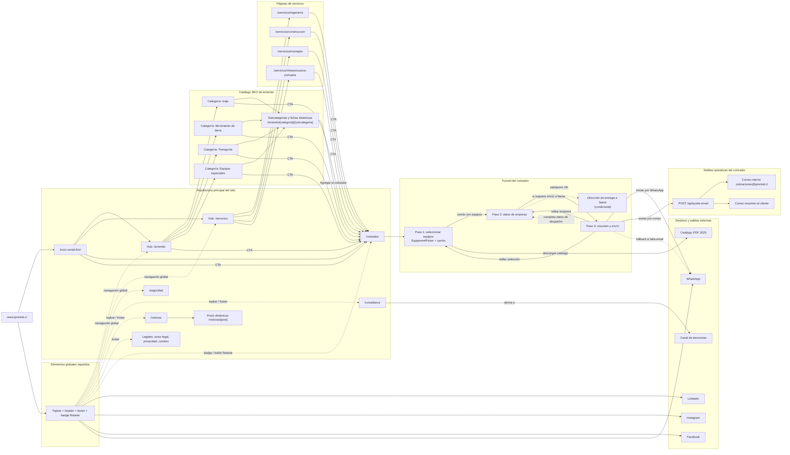

# Arquitectura de informacion y flujo del cotizador web

Fuente analizada: rutas Astro en `src/pages`, componentes del cotizador en `src/components/quote`, navegación compartida en `src/data/site.ts` y catálogo dinámico en `src/data/rental.ts`.

Criterio del esquema:
- Muestra la arquitectura principal del sitio `iprental.cl`.
- Separa catálogo SEO, puntos de entrada al cotizador y flujo interno del wizard.
- Incluye salidas externas y operativas confirmadas en el código.
- Simplifica las rutas dinámicas agrupándolas por familia para que el diagrama siga siendo legible.

