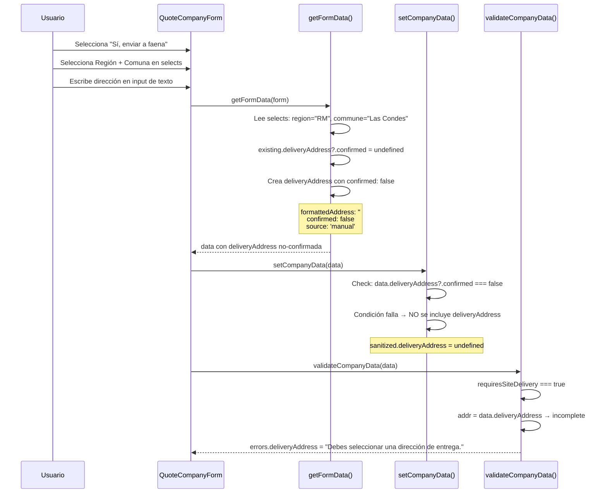
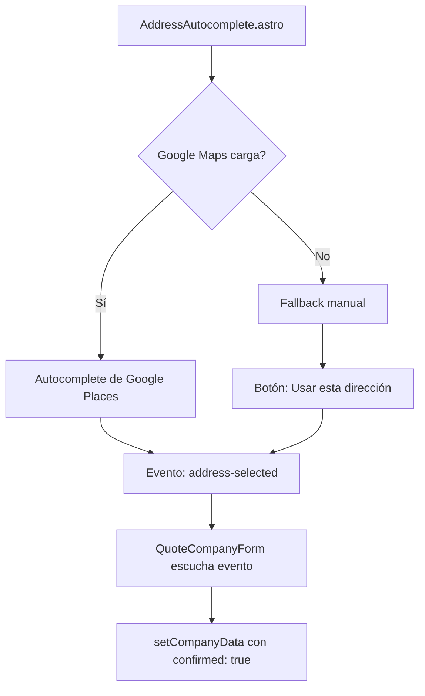
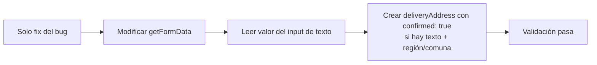
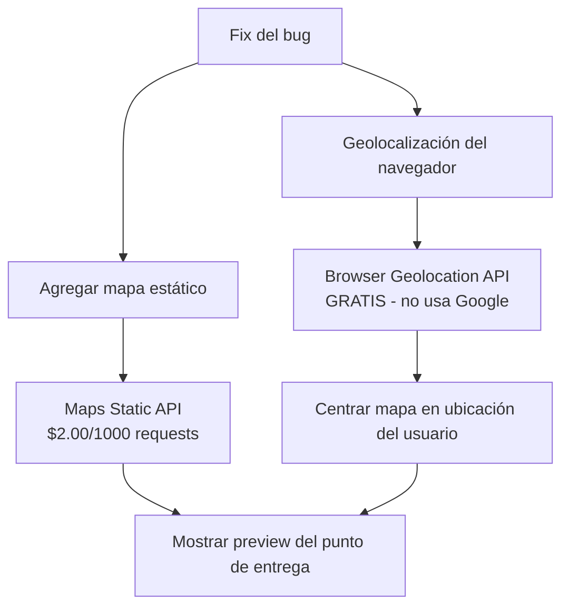
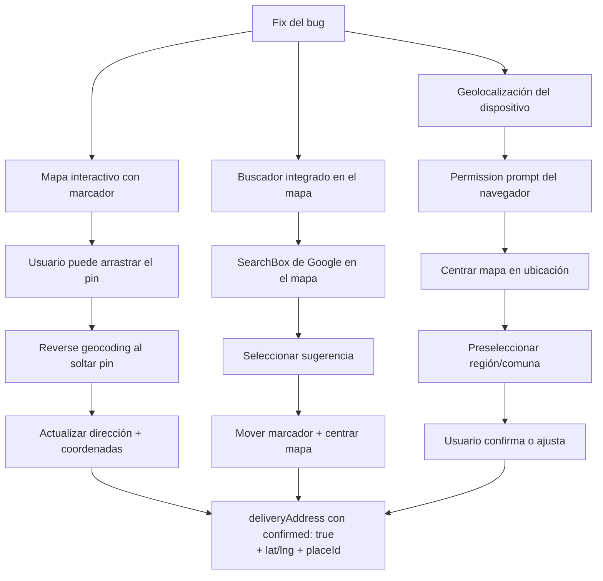
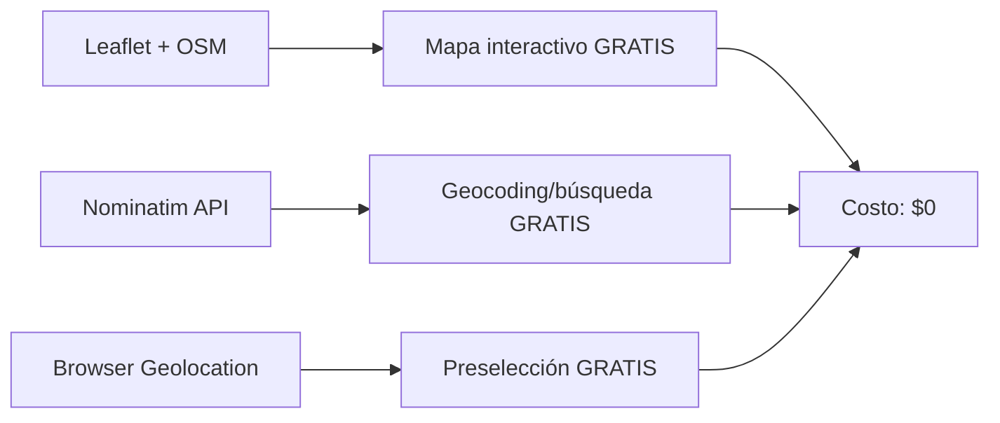
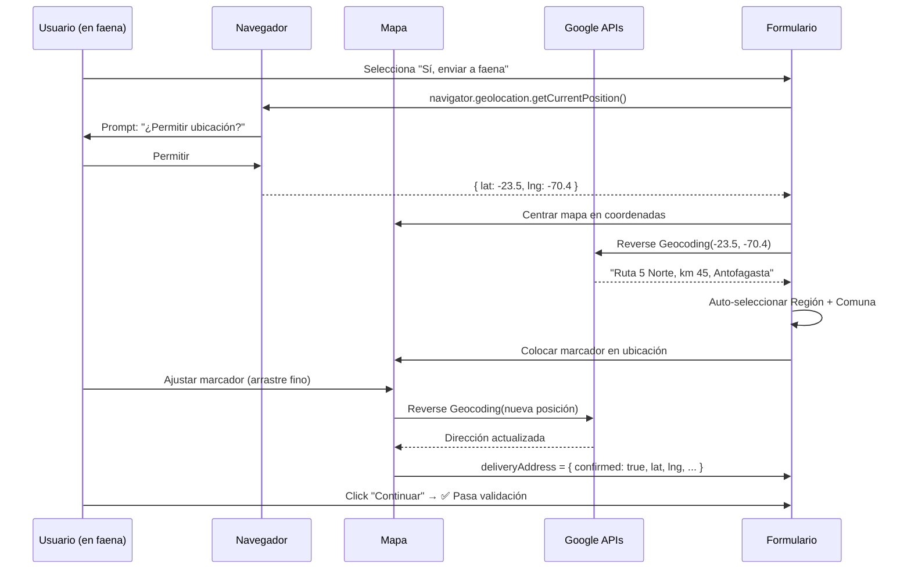
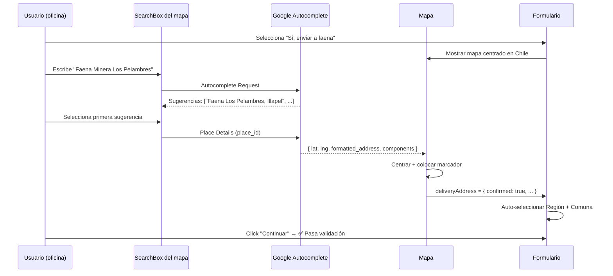

# Análisis: Sección de Dirección de Entrega (Step 2 del Cotizador)

## 1. Diagnóstico del Bug Actual

### 1.1 Descripción del problema

Cuando el usuario selecciona "Sí, enviar a faena" en el step 2 del wizard, se despliega una sección con:
- Select de **Región**
- Select de **Comuna**
- Input de **Dirección de entrega** (componente `AddressAutocomplete`)

El usuario reporta que **aunque seleccione región, comuna y escriba en el input de dirección**, el formulario sigue mostrando error de "campo faltante" al intentar avanzar.

### 1.2 Root Cause Analysis

El bug se origina en la **interacción entre tres capas** del sistema de validación:



### 1.3 Archivos y líneas involucradas

| Archivo | Líneas | Rol en el bug |
|---------|--------|---------------|
| `src/components/quote/QuoteCompanyForm.astro` | 279-288 | `getFormData()` crea `deliveryAddress` con `confirmed: false` cuando solo hay selects |
| `src/lib/quoteCompany.ts` | 140-151 | `setCompanyData()` descarta la dirección si `confirmed !== true` |
| `src/types/quoteCompany.ts` | 211-226 | `validateCompanyData()` exige `confirmed: true` + `formattedAddress` no-vacío |
| `src/components/quote/AddressAutocomplete.astro` | 464-474 | El input del autocomplete no dispara `address-selected` al escribir texto libre |

### 1.4 Escenario exacto del bug

1. Usuario selecciona "Sí, enviar a faena"
2. Selecciona Región = "Metropolitana" y Comuna = "Las Condes"
3. Escribe "Av. Apoquindo 1234" en el input de dirección
4. **NO selecciona una sugerencia del autocomplete de Google** (o Google no cargó)
5. `getFormData()` crea `{ formattedAddress: '', confirmed: false, source: 'manual' }`
6. `setCompanyData()` descarta el objeto porque `confirmed === false`
7. `validateCompanyData()` detecta `deliveryAddress` ausente → **ERROR**

**El problema fundamental**: El texto que el usuario escribe en el input NO se lee como `formattedAddress`. El sistema solo acepta direcciones confirmadas vía:
- Selección de sugerencia de Google Places Autocomplete, O
- Botón "Usar esta dirección" del fallback manual

---

## 2. Estado Actual de la Implementación

### 2.1 Componente AddressAutocomplete

El componente ya existe y tiene una arquitectura sólida:



**Lo que ya funciona:**
- ✅ Carga asíncrona del script de Google Maps
- ✅ Autocomplete con restricciones a Chile
- ✅ Extracción de componentes (comuna, región) desde `address_components`
- ✅ Fallback manual cuando Google no carga
- ✅ Eventos custom (`address-selected`, `address-cleared`, `address-error`)
- ✅ Restauración desde localStorage
- ✅ Estilos integrados con el design system

**Lo que NO existe:**
- ❌ Mapa interactivo (solo hay input de texto con sugerencias)
- ❌ Geolocalización del dispositivo
- ❌ Marcador (pin) visual en mapa
- ❌ Búsqueda dentro del mapa

### 2.2 APIs de Google Maps ya utilizadas

| API | Estado | Propósito |
|-----|--------|-----------|
| Maps JavaScript API | ✅ Configurada (apiKey como prop) | Renderizado del mapa |
| Places Library (Autocomplete) | ✅ Implementada | Búsqueda de direcciones |
| Maps Embed/Static | ❌ No usada | Podría usarse para preview |

---

## 3. Análisis de Costos de Google Maps Platform

### 3.1 APIs necesarias para la funcionalidad solicitada

| API / SKU | Categoría | Uso en este proyecto |
|-----------|-----------|---------------------|
| **Dynamic Maps** | Essentials | Mostrar mapa interactivo con marcador |
| **Autocomplete Requests** (New) | Essentials | Buscador de direcciones con sugerencias |
| **Place Details Essentials** | Essentials | Obtener coordenadas y datos del lugar seleccionado |
| **Geocoding** | Essentials | Convertir dirección escrita a coordenadas (fallback) |
| **Geolocation** | Essentials | Capturar ubicación del dispositivo para preseleccionar |

### 3.2 Modelo de precios actualizado (Agosto 2026)

Google ofrece **dos modelos**: Pay-as-you-go y Suscripción.

#### Opción Pay-as-you-go (sin compromiso)

| SKU | Rango | Precio unitario |
|-----|-------|-----------------|
| Dynamic Maps | 0-100,000 cargas/mes | **$7.00** por 1,000 cargas |
| Autocomplete Requests (New) | 0-100,000/mes | **$2.83** por 1,000 requests |
| Place Details Essentials | 0-100,000/mes | **$17.00** por 1,000 requests |
| Geocoding | 0-100,000/mes | **$5.00** por 1,000 requests |
| Geolocation | 0-100,000/mes | **$5.00** por 1,000 requests |

#### Opción Suscripción Essentials ($275/mes)

Incluye **100,000 llamadas/mes** combinadas entre:
- Dynamic Maps (ilimitadas como SDK)
- Autocomplete Requests
- Place Details Essentials
- Geocoding
- Geolocation
- + otros (Time Zone, Maps Embed, Static Maps, etc.)

Ahorro: hasta **$625/mes** vs pay-as-you-go si se superan las 100K llamadas.

### 3.3 Estimación de costos para este proyecto

**Escenario realista**: Sitio de cotización B2B de equipos industriales en Chile.

| Métrica | Estimación baja | Estimación alta |
|---------|----------------|-----------------|
| Visitantes únicos/mes al cotizador | 200 | 2,000 |
| % que seleccionan "enviar a faena" | 40% | 60% |
| Usuarios que usan el mapa/autocomplete | 80 | 1,200 |
| Cargas de mapa dinámico | 80 | 1,200 |
| Requests de autocomplete (3-5 por sesión) | 240 - 400 | 3,600 - 6,000 |
| Place Details (1 por selección) | 80 | 1,200 |
| Geolocation (1 por sesión) | 80 | 1,200 |

#### Costo mensual estimado (Pay-as-you-go)

| Escenario | Cálculo | Costo/mes |
|-----------|---------|-----------|
| **Bajo** (80 usuarios) | Maps: $0.56 + AC: $1.13 + PD: $1.36 + Geo: $0.40 | **~$3.45 USD** |
| **Medio** (500 usuarios) | Maps: $3.50 + AC: $7.08 + PD: $8.50 + Geo: $2.50 | **~$21.58 USD** |
| **Alto** (1,200 usuarios) | Maps: $8.40 + AC: $16.98 + PD: $20.40 + Geo: $6.00 | **~$51.78 USD** |

#### ⚠️ Crédito mensual de Google

> Google ofrece un crédito de **$200 USD/mes** para Google Maps Platform (vigente hasta al menos Feb 2025, verificar extensión). Esto **cubriría completamente** el uso en los escenarios bajo y medio, y parcialmente el alto.

**Conclusión de costos**: Para el volumen esperado de este sitio, el costo es **muy bajo o nulo** gracias al crédito mensual de $200.

---

## 4. Opciones de Implementación

### Opción A: Solo corrección del bug (sin mapa)

**Descripción**: Corregir el bug de validación para que la dirección escrita manualmente en el input sea aceptada, sin agregar mapa interactivo.



**Cambios requeridos:**
1. `QuoteCompanyForm.astro` → `getFormData()`: Si el input de dirección tiene texto Y hay región/comuna seleccionados, crear `deliveryAddress` con `confirmed: true` y `source: 'manual'`
2. Mensaje de validación más claro: diferenciar entre "escribe una dirección" y "selecciona una sugerencia"

| Aspecto | Detalle |
|---------|---------|
| **Esfuerzo** | Low (2-4 horas) |
| **Costo Google Maps** | $0 (sin APIs adicionales) |
| **UX** | Funcional pero básico |
| **Riesgo** | Direcciones imprecisas sin coordenadas |
| **Ventaja** | Rápido, sin dependencias externas |

---

### Opción B: Fix del bug + Mapa estático con geolocalización

**Descripción**: Corregir el bug + agregar un mapa estático (imagen) que se actualiza cuando se selecciona una dirección, más geolocalización del navegador para preselección.



**Cambios requeridos:**
1. Todo lo de Opción A
2. Nuevo componente `DeliveryMapPreview.astro` con `` del Static Maps API
3. `navigator.geolocation.getCurrentPosition()` para preseleccionar región/comuna
4. Al seleccionar dirección en autocomplete, actualizar la imagen del mapa

| Aspecto | Detalle |
|---------|---------|
| **Esfuerzo** | Medium (1-2 días) |
| **Costo Google Maps** | ~$2/1000 imágenes estáticas (cubierto por crédito $200) |
| **UX** | Buena - usuario ve el punto en el mapa |
| **Riesgo** | Mapa no interactivo, solo imagen |
| **Ventaja** | Feedback visual sin costo de mapa dinámico |

---

### Opción C: Fix del bug + Mapa interactivo completo (RECOMENDADA)

**Descripción**: Corregir el bug + integrar un mapa interactivo de Google Maps con marcador arrastrable, buscador integrado, y geolocalización del dispositivo.



**Componentes a crear/modificar:**

| Componente | Cambio | Esfuerzo |
|------------|--------|----------|
| `AddressAutocomplete.astro` | Agregar mapa + marcador + searchbox | High |
| `QuoteCompanyForm.astro` | Integrar geolocalización + nuevo layout | Medium |
| `quoteCompany.ts` (types) | No requiere cambios (ya soporta lat/lng) | None |
| `quoteCompany.ts` (lib) | No requiere cambios | None |
| Nuevo: `DeliveryMap.astro` | Mapa interactivo con marcador arrastrable | High |
| CSS | Estilos para mapa responsivo | Low |

**APIs utilizadas:**

| API | Propósito | Costo unitario |
|-----|-----------|---------------|
| Dynamic Maps | Mapa interactivo | $7.00/1000 cargas |
| Autocomplete (New) | Buscador en el mapa | $2.83/1000 requests |
| Place Details Essentials | Datos del lugar seleccionado | $17.00/1000 requests |
| Geocoding | Reverse geocoding al mover pin | $5.00/1000 requests |
| Geolocation | Ubicación del dispositivo | $5.00/1000 requests |

| Aspecto | Detalle |
|---------|---------|
| **Esfuerzo** | High (3-5 días) |
| **Costo Google Maps** | ~$5-52/mes (cubierto por crédito $200 en la mayoría de casos) |
| **UX** | Excelente - experiencia tipo Google Maps |
| **Riesgo** | Complejidad de implementación, performance en móvil |
| **Ventaja** | Ubicación exacta, coordenadas precisas, mejor para logística |

---

### Opción D: Alternativa sin Google Maps (OpenStreetMap + Leaflet)

**Descripción**: Usar OpenStreetMap con Leaflet (gratis) para el mapa, y Nominatim para geocoding/búsqueda.



| Aspecto | Detalle |
|---------|---------|
| **Esfuerzo** | High (4-6 días) |
| **Costo** | $0 (todo open source) |
| **UX** | Buena, pero menos pulida que Google |
| **Riesgo** | Nominatim tiene rate limits estrictos (1 req/seg), calidad de datos en Chile variable |
| **Ventaja** | Sin costo, sin API key |
| **Desventaja** | Datos menos precisos en zonas rurales/mineras de Chile |

---

## 5. Tabla Comparativa de Opciones

| Criterio | A (Solo fix) | B (Mapa estático) | C (Mapa interactivo) | D (OpenStreetMap) |
|----------|:---:|:---:|:---:|:---:|
| **Corrige el bug** | ✅ | ✅ | ✅ | ✅ |
| **Mapa visual** | ❌ | 📷 Imagen | 🗺️ Interactivo | 🗺️ Interactivo |
| **Marcador arrastrable** | ❌ | ❌ | ✅ | ✅ |
| **Buscador integrado** | ❌ | ❌ | ✅ (Google) | ✅ (Nominatim) |
| **Geolocalización** | ❌ | ✅ | ✅ | ✅ |
| **Coordenadas exactas** | ❌ | Parcial | ✅ | ✅ |
| **Costo mensual** | $0 | ~$2 | ~$5-52 | $0 |
| **Esfuerzo** | Low (2-4h) | Medium (1-2d) | High (3-5d) | High (4-6d) |
| **Calidad datos Chile** | N/A | Alta | Excelente | Variable |
| **Performance** | Óptima | Óptima | Buena | Buena |
| **Mantenimiento** | Mínimo | Bajo | Medio | Medio-Alto |

---

## 6. Recomendación

### Para este proyecto, recomiendo la **Opción C** (Mapa interactivo completo) con implementación progresiva:

**Fase 1 — Bug fix urgente** (Opción A, 2-4 horas)
- Corregir `getFormData()` para aceptar dirección manual escrita
- Mejorar mensajes de validación
- **Esto se puede hacer HOY**

**Fase 2 — Geolocalización + Mapa interactivo** (Opción C, 3-5 días)
- Agregar mapa con marcador arrastrable
- Integrar geolocalización del navegador
- Buscador dentro del mapa
- Reverse geocoding al mover el pin

**Justificación:**
1. El componente `AddressAutocomplete.astro` ya tiene una base sólida que se puede extender
2. Los tipos `DeliveryAddress` ya soportan `latitude`, `longitude`, `placeId`
3. El costo está cubierto por el crédito mensual de $200 de Google
4. Para envío a faenas mineras/sitios de obra, las coordenadas exactas son críticas para la logística
5. La geolocalización del dispositivo es especialmente útil cuando el usuario está EN la faena

---

## 7. Consideraciones Técnicas

### 7.1 API Key de Google Maps

El componente ya recibe `apiKey` como prop. Se necesita:
- Habilitar: Maps JavaScript API, Places API, Geocoding API, Geolocation API
- Restricciones: HTTP referrers (solo el dominio del sitio)
- Cuota: Configurar alertas de uso en Google Cloud Console

### 7.2 Geolocalización del navegador

```typescript
// No requiere API de Google - es nativo del navegador
navigator.geolocation.getCurrentPosition(
  (position) => {
    const { latitude, longitude } = position.coords;
    // Centrar mapa en esta ubicación
    // Opcionalmente: reverse geocoding para preseleccionar región/comuna
  },
  (error) => {
    // El usuario denegó el permiso → fallback a selección manual
  },
  { enableHighAccuracy: true, timeout: 10000 }
);
```

**Nota**: La Geolocation API del navegador es **gratuita** y no consume cuota de Google. Solo se necesita Google Geolocation API ($5/1000) si se quiere usar torres WiFi/celdas cuando GPS no está disponible.

### 7.3 Performance

- Cargar el script de Google Maps solo cuando se selecciona "Sí, enviar a faena" (lazy load)
- El mapa solo se renderiza cuando la sección es visible
- Usar `loading="lazy"` si se incluye mapa estático como fallback

### 7.4 Responsive

- En móvil: mapa a pantalla completa dentro de la sección
- En desktop: mapa al lado del formulario
- Marcador arrastrable funciona con touch events en móvil

---

## 8. Flujos de Usuario Propuestos (Opción C)

### Flujo 1: Usuario con GPS activo (en faena)



### Flujo 2: Usuario en oficina (busca dirección de faena)



---

## 9. Riesgos y Mitigaciones

| Riesgo | Impacto | Probabilidad | Mitigación |
|--------|---------|-------------|------------|
| Google aumenta precios | Medio | Baja | Mantener fallback manual; considerar OSM como backup |
| API key comprometida | Alto | Baja | Restringir por dominio + presupuesto máximo en GCP |
| Usuario deniega geolocalización | Bajo | Alta | Fallback a búsqueda manual (ya implementado) |
| Mapa lento en móvil 3G | Medio | Media | Lazy load, no cargar mapa hasta que sea visible |
| Datos de Google imprecisos en zona rural | Medio | Media | Permitir ajuste manual del marcador + nota de referencia |
| Crédito mensual de Google se elimina | Alto | Baja | Monitorear anuncios; tener presupuesto de respaldo ~$50/mes |

---

## 10. Próximos Pasos

1. **Decidir opción**: ¿A, B, C o D? (Recomendación: A inmediato + C en fase 2)
2. **Configurar API key**: Habilitar APIs necesarias en Google Cloud Console
3. **Implementar Fase 1**: Fix del bug (inmediato, sin dependencia de decisión)
4. **Implementar Fase 2**: Según opción elegida
5. **Testing**: Verificar en Chrome, Safari, Firefox + móvil (iOS/Android)
6. **Monitoreo**: Configurar alertas de uso en Google Cloud

---

## Referencias

- [Google Maps Platform Pricing](https://mapsplatform.google.com/pricing/)
- [Maps JavaScript API Billing](https://developers.google.com/maps/documentation/javascript/usage-and-billing)
- [Places API Billing](https://developers.google.com/maps/documentation/places/web-service/usage-and-billing)
- [Geolocation API](https://developer.mozilla.org/en-US/docs/Web/API/Geolocation_API) (nativa del navegador, gratuita)
- [Leaflet.js](https://leafletjs.com/) (alternativa open source)
