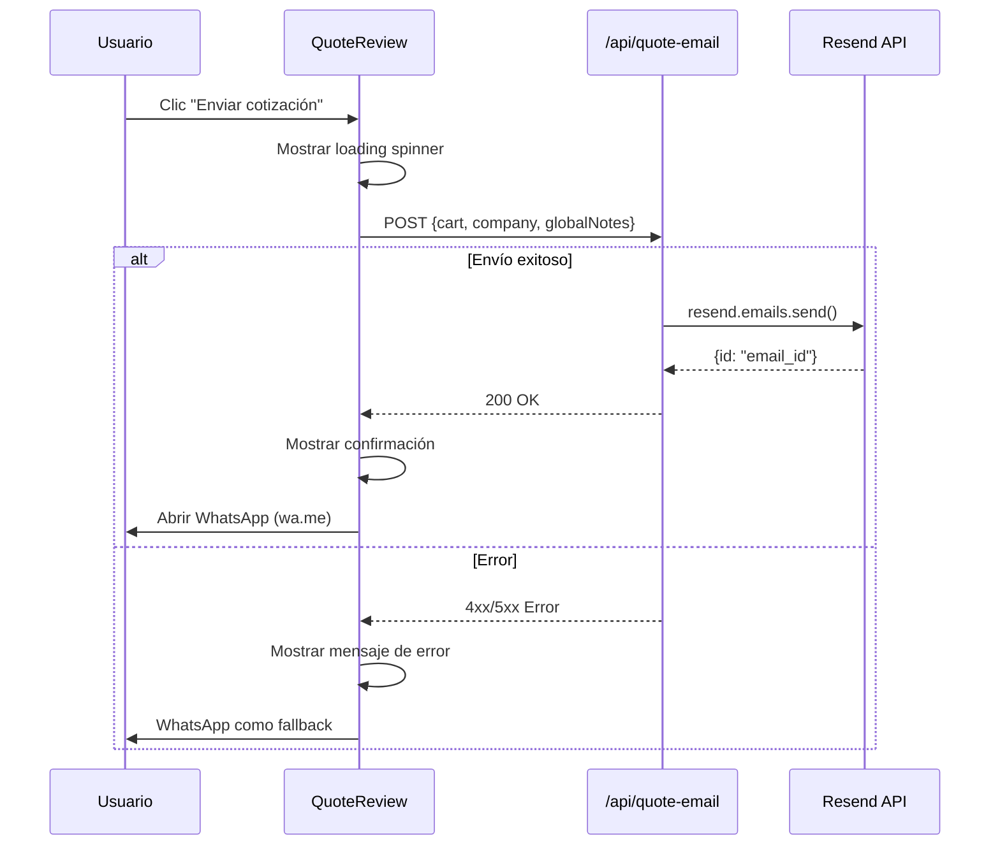

# Resend Email Integration for Cotizador

## Overview

Integrar la API de Resend para enviar correos electrónicos automáticos al finalizar una cotización en el wizard. El correo incluirá el resumen completo de equipos seleccionados, datos de la empresa y notas globales.

## Requisitos Funcionales

1. **Envío automático de correo** al completar la cotización (paso 3 → acción "Enviar cotización")
2. **Contenido del correo**: Resumen de equipos, datos de empresa, totales y notas
3. **Feedback visual**: Indicador de carga y confirmación de envío
4. **Manejo de errores**: Feedback claro si el envío falla
5. **Seguridad**: API key nunca expuesta al cliente

## Arquitectura Recomendada

### Cambio de SSG a SSR

El proyecto actualmente usa `output: 'static'`. Para enviar correos de forma segura (sin exponer la API key), necesitamos un endpoint server-side.

**Opción recomendada**: Adaptador de Node.js + endpoint API en Astro.

```
┌─────────────────────────────────────────────────────────────┐
│                      Cliente (Browser)                       │
│                                                             │
│  ┌─────────────┐    ┌─────────────┐    ┌─────────────┐     │
│  │  Step 1     │ →  │  Step 2     │ →  │  Step 3     │     │
│  │  Equipos    │    │  Empresa    │    │  Review     │     │
│  └─────────────┘    └─────────────┘    └──────┬──────┘     │
│                                               │             │
│                                    ┌──────────▼──────────┐  │
│                                    │  "Enviar cotización" │  │
│                                    └──────────┬──────────┘  │
│                                               │             │
│                              POST /api/quote-email          │
│                              { cart, company, notes }       │
└───────────────────────────────────────────────┬─────────────┘
                                                │
                                    ┌───────────▼───────────┐
                                    │   Astro API Endpoint   │
                                    │   src/pages/api/       │
                                    │   quote-email.ts       │
                                    └───────────┬───────────┘
                                                │
                                    ┌───────────▼───────────┐
                                    │     Resend API         │
                                    │   emails.send()        │
                                    └───────────────────────┘
```

### Decisiones Técnicas Clave

| Decisión | Selección | Razón |
|----------|-----------|-------|
| SSR Adapter | Node.js (oficial) | Más flexible, sin vendor lock-in |
| Endpoint | Astro API route | Nativo, tipado, sin dependencias extra |
| Resend SDK | `resend` (oficial) | Soporte oficial, bien tipado |
| Email template | HTML inline | Simple, sin dependencias de templating |
| Envío | Server-side | API key protegida, nunca expuesta al cliente |

## Requisitos Técnicos

### Dependencias Nuevas

```json
{
  "resend": "^4.0.0",
  "@astrojs/node": "^9.0.0"
}
```

### Variables de Entorno

```env
# .env
RESEND_API_KEY=re_xxxxxxxxx
QUOTE_EMAIL_FROM=cotizaciones@tudominio.com
QUOTE_EMAIL_TO=matias.cp@dalt.cl
```

> **NOTA**: El usuario debe reemplazar `re_xxxxxxxxx` con su API key real de Resend.

### Cambios en astro.config.mjs

```javascript
import { defineConfig } from 'astro/config';
import node from '@astrojs/node';

export default defineConfig({
  output: 'server',  // Cambiar de 'static' a 'server'
  adapter: node({
    mode: 'standalone'
  }),
  // ... resto de configuración
});
```

## Estructura de Archivos

```
src/
├── pages/
│   └── api/
│       └── quote-email.ts        # Endpoint API para envío de correo
├── lib/
│   ├── resend.ts                 # Cliente Resend configurado
│   └── quoteEmailTemplate.ts     # Template HTML del correo
├── components/
│   └── quote/
│       └── QuoteReview.astro     # Modificado: agrega lógica de envío por email
└── ...

.env                              # RESEND_API_KEY
```

## Implementación Steps

### 1. Instalar dependencias (Effort: Low)

```bash
npm install resend @astrojs/node
```

### 2. Configurar adaptador Node.js (Effort: Low)

- Actualizar `astro.config.mjs` para usar `output: 'server'` y el adaptador Node
- Verificar que el build funcione correctamente

### 3. Crear cliente Resend (Effort: Low)

- Archivo: `src/lib/resend.ts`
- Inicializar el SDK con la API key desde variables de entorno
- Exportar instancia reutilizable

### 4. Crear template de correo (Effort: Medium)

- Archivo: `src/lib/quoteEmailTemplate.ts`
- Generar HTML con:
  - Encabezado con logo/marca
  - Tabla de equipos seleccionados
  - Datos de la empresa
  - Totales
  - Notas globales
  - Footer con datos de contacto

### 5. Crear endpoint API (Effort: Medium)

- Archivo: `src/pages/api/quote-email.ts`
- Método POST que recibe: `{ cart, company, globalNotes }`
- Validar datos de entrada
- Construir el template HTML
- Enviar correo usando Resend SDK
- Retornar respuesta de éxito/error

### 6. Modificar QuoteReview para envío por email (Effort: Medium)

- Agregar función `sendQuoteEmail()` en el script del componente
- Al hacer clic en "Enviar cotización":
  1. Mostrar indicador de carga
  2. Enviar POST a `/api/quote-email`
  3. Si éxito: abrir WhatsApp + mostrar confirmación
  4. Si error: mostrar mensaje de error
- Mantener funcionalidad de WhatsApp como fallback

### 7. Testing y validación (Effort: Low)

- Verificar envío con dominio de prueba (`onboarding@resend.dev`)
- Probar con diferentes cantidades de equipos
- Verificar manejo de errores
- Probar en producción con dominio verificado

## Template de Correo (Ejemplo)

```html
<!DOCTYPE html>
<html>
<head>
  <meta charset="utf-8">
  <meta name="viewport" content="width=device-width, initial-scale=1.0">
  <style>
    body { font-family: Arial, sans-serif; line-height: 1.6; color: #333; }
    .container { max-width: 600px; margin: 0 auto; padding: 20px; }
    .header { background-color: #1a1a2e; color: white; padding: 20px; text-align: center; }
    .section { margin: 20px 0; padding: 15px; background-color: #f9f9f9; border-radius: 5px; }
    .section-title { font-weight: bold; color: #1a1a2e; margin-bottom: 10px; }
    table { width: 100%; border-collapse: collapse; margin: 10px 0; }
    th, td { padding: 8px; text-align: left; border-bottom: 1px solid #ddd; }
    th { background-color: #1a1a2e; color: white; }
    .totals { background-color: #e8f4f8; padding: 15px; border-radius: 5px; }
    .footer { text-align: center; margin-top: 30px; font-size: 12px; color: #666; }
  </style>
</head>
<body>
  <div class="container">
    <div class="header">
      <h1>Nueva Solicitud de Cotización</h1>
    </div>
    
    <div class="section">
      <div class="section-title">Equipos Seleccionados</div>
      <table>
        <thead>
          <tr>
            <th>Equipo</th>
            <th>Cantidad</th>
            <th>Período</th>
            <th>Inicio</th>
          </tr>
        </thead>
        <tbody>
          <!-- Items generados dinámicamente -->
        </tbody>
      </table>
    </div>

    <div class="section">
      <div class="section-title">Datos de la Empresa</div>
      <!-- Datos de empresa generados dinámicamente -->
    </div>

    <div class="totals">
      <strong>Totales:</strong>
      <!-- Totales generados dinámicamente -->
    </div>

    <div class="footer">
      <p>IP Proyectos Industriales</p>
      <p>Este correo fue generado automáticamente desde el cotizador en línea.</p>
    </div>
  </div>
</body>
</html>
```

## Flujo de Envío



## Riesgos y Mitigaciones

| Riesgo | Impacto | Mitigación |
|--------|---------|------------|
| API key expuesta | Crítico | Solo usar en server-side, nunca en client |
| Cambio de SSG a SSR | Alto | Verificar que todas las páginas funcionen correctamente |
| Rate limiting de Resend | Medio | Implementar retry con backoff exponencial |
| Correo a spam | Medio | Verificar dominio en Resend, usar DKIM/SPF |
| Error de red | Bajo | Mostrar error claro, mantener WhatsApp como fallback |

## Timeline Estimado

- **Total**: 2-3 días
- **Día 1**: Configuración SSR + cliente Resend + endpoint API
- **Día 2**: Template de correo + integración con QuoteReview
- **Día 3**: Testing + ajustes + despliegue

## Próximos Pasos

1. **Confirmar**: ¿Cambiar a SSR o usar serverless externo?
2. **Confirmar**: ¿Destinatarios del correo (empresa, cliente, ambos)?
3. **Confirmar**: ¿Dominio verificado en Resend?
4. **Implementar**: Seguir los pasos de implementación
5. **Probar**: Testing en desarrollo y producción
