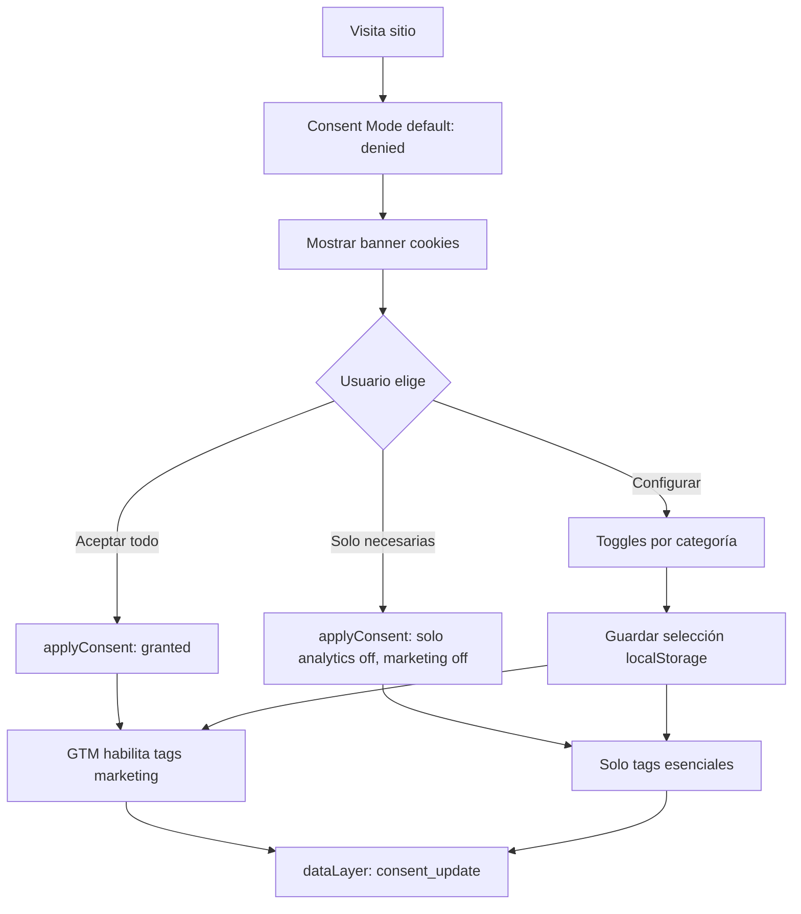

# Gestión de consentimiento y Consent Mode v2

## Por qué es una dependencia crítica

- **Chile:** la política debe revisarse considerando la Ley 19.628 y la entrada en vigor de
  la Ley 21.719, además de contratos y exigencias de clientes mineros. El plan no reemplaza
  una revisión jurídica.
- **Google Ads:** Consent Mode v2 controla las señales `ad_user_data` y
  `ad_personalization`, además de `ad_storage` y `analytics_storage`. Su configuración
  debe corresponder a la política y región aplicable; no activar tags de marketing por
  defecto sin la decisión documentada del responsable.
- **Calidad de datos:** un banner por categorías mejora la tasa de aceptación vs.
  "todo o nada".

## Qué construir

### 1. CMP/banner de cookies (componente nuevo o proveedor CMP)

- Aparece en primera visita y persiste la elección en una cookie propia o mecanismo aprobado
  por el CMP. `localStorage` solo no debe ser la única fuente si el estado debe estar disponible
  antes del bootstrap.
- Tres acciones: **Aceptar todo**, **Solo necesarias**, **Configurar**.
- Panel "Configurar" con toggles por categoría:
  - **Necesarias** (siempre on, no desmarcable): seguridad/sesión.
  - **Analíticas** (GA4, Clarity).
  - **Marketing** (Google Ads, remarketing, LinkedIn).

### 2. Puente con GTM (Consent Mode v2)

Al elegir, actualizar el estado mediante la plantilla/CMP compatible con GTM. Si se mantiene
una solución propia, el equipo debe implementar y probar las APIs de consentimiento; el
evento `consent_update` es solo auditoría y no sustituye la actualización real:

```js
function applyConsent(analytics, marketing) {
  window.gtag?.('consent','update',{
    'analytics_storage': analytics ? 'granted' : 'denied',
    'ad_storage': marketing ? 'granted' : 'denied',
    'ad_user_data': marketing ? 'granted' : 'denied',
    'ad_personalization': marketing ? 'granted' : 'denied'
  });
  window.dataLayer.push({ event: 'consent_update',
    analytics, marketing });
}
```

GTM usa el trigger `consent_update` para habilitar/deshabilitar tags de marketing.

### 3. Página `/cookies` real

Reemplazar el placeholder con texto legal (categorías, base jurídica, contacto DPO,
enlaces a privacidad/aviso-legal ya existentes). Vincular desde el footer (ya está).

## Flujo



Diagrama: [`flows/consent-flow.mmd`](./flows/consent-flow.mmd).

## Riesgos

- **Banner intrusivo vs. conversión:** un modal bloqueante puede bajar la tasa de
  cotización. Recomendado: banner no bloqueante (bottom bar) con "Solo necesarias" visible.
- **Cumplimiento CL:** no asumir que el marco chileno equivale o no equivale a GDPR sin
  revisión jurídica; documentar base legal, proveedores, finalidades, retención y cómo revocar
  el consentimiento en `/cookies` y `/privacidad`.
- **Dependencias:** requiere que `gtm-core` ya inicialice `gtag('consent','default')`.
