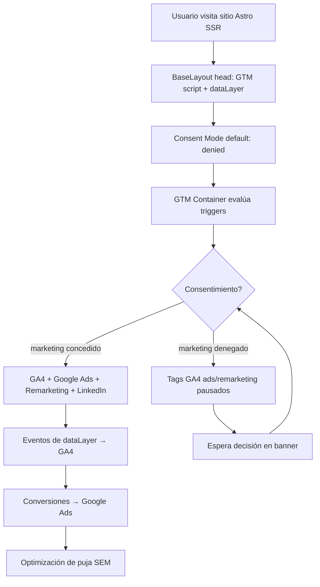

# Dónde, cómo y por qué aplicar GTM

## 1. Dónde se inyecta (punto exacto)

El sitio usa `src/layouts/BaseLayout.astro` como layout canónico de **todas** las páginas
(head renderizado en servidor porque `output: server`). Se insertan dos bloques:

**A) En `<head>` (inmediatamente después de `<meta charset>`) — snippet GTM:**

```html
<!-- Google Tag Manager -->
<script is:inline>(function(w,d,s,l,i){w[l]=w[l]||[];w[l].push({'gtm.start':
new Date().getTime(),event:'gtm.js'});var f=d.getElementsByTagName(s)[0],
j=d.createElement(s),dl=l!='dataLayer'?'&l='+l:'';j.async=true;j.src=
'https://www.googletagmanager.com/gtm.js?id='+i+dl;f.parentNode.insertBefore(j,f);
})(window,document,'script','dataLayer','GTM-XXXXXXX');</script>
<!-- End Google Tag Manager -->
```

> Usar `is:inline` en Astro para que el script no sea procesado/emitido como módulo.

**B) Al inicio de `<body>` — fallback `<noscript>` (requerido por Google):**

```html
<!-- Google Tag Manager (noscript) -->
<noscript><iframe src="https://www.googletagmanager.com/ns.html?id=GTM-XXXXXXX"
height="0" width="0" style="display:none;visibility:hidden"></iframe></noscript>
<!-- End Google Tag Manager (noscript) -->
```

Colocar justo después de `<body>` (antes de `SkipLink`) para máxima cobertura.

## 2. Cómo inicializar el dataLayer (orden importa)

Antes del snippet GTM (en el mismo `<head>`, script `is:inline` previo) inicializar
el `dataLayer` con defaults y estado de consentimiento:

```html
<script is:inline>
  window.dataLayer = window.dataLayer || [];
  // Consent Mode v2: arranca denegado hasta decisión del usuario.
  window.dataLayer.push({
    'gtm.start': new Date().getTime(),
    'event': 'gtm.js',
    'page_type': '{{page_type}}',
    'content_group': '{{content_group}}',
    'locale': 'es-CL'
  });
  // Consent Mode defaults (se actualiza desde el CMP/plantilla de consentimiento)
  function gtag(){dataLayer.push(arguments);}
   gtag('consent','default',{
    'ad_storage':'denied','ad_user_data':'denied','ad_personalization':'denied',
    'analytics_storage':'denied','region':'CL'
   });
</script>
```

 Los valores de contexto deben implementarse como props explícitos del layout o como un
 evento común emitido por cada página. No usar plantillas `{{page_type}}` literales en el
 HTML. Tampoco enviar `page_view` manual si la etiqueta de Google/GA4 ya lo registra.

## 3. Por qué este enfoque

- **SSR head:** el snippet se entrega en el HTML inicial → GTM carga temprano, sin
  parpadeo ni dependencia de hidratación de Astro.
- **Un solo lugar:** cambiar/versionar GTM toca un archivo (`BaseLayout.astro`), no 50 páginas.
- **Consent Mode nativo:** GTM + `gtag('consent',...)` es la vía oficial para cumplir
  LPDP y las políticas de Google Ads (ads personalizados requieren consentimiento).
- **dataLayer temprano:** eventos de `page_view` y de conversión se capturan aunque el
  usuario navegue rápido.

## 4. Arquitectura de capas



Ver diagrama completo en [`flows/gtm-architecture.mmd`](./flows/gtm-architecture.mmd).

## 5. Pasos de implementación

1. Crear contenedor GTM web y obtener `GTM-XXXXXXX`.
2. Insertar snippet `<head>` + `<noscript>` en `BaseLayout.astro` (Low).
3. Inicializar `dataLayer` con `page_type`/`content_group` como props del layout (Low).
4. Configurar `gtag('consent','default',{denied})` (Low) — ver `consent-management.md`.
5. Publicar variables/triggers/events desde `event-tracking-plan.md` en la interfaz GTM (Medium).
6. Conectar GA4 y Google Ads desde GTM (Medium).
7. QA con Preview de GTM + modo debug de GA4 (Medium).

## 6. Ajustes específicos del repositorio

- El layout común real es `src/layouts/BaseLayout.astro`; no se debe modificar cada página.
- La conversión del cotizador no ocurre en `/gracias`: `QuoteReview.astro` llama a
  `/api/quote-email` y muestra feedback inline. El evento primario debe salir del resultado
  exitoso de esa llamada.
- `QuoteFormAdvanced.astro`, `ContactSection.astro` y el formulario de seguridad apuntan a
  `/api/contact`; confirmar ese endpoint antes de publicar conversiones de formulario.
- `quote_add_item` y `quote-wizard-navigate` ya existen y pueden alimentar listeners globales.
- No incluir RUT, email, teléfono, nombre, dirección ni notas en la capa de datos. Si se
  implementan Conversiones mejoradas de clientes potenciales, utilizar su configuración
  específica, consentimiento y hash/normalización según Google Ads.

> Para consentimiento administrado, Google recomienda usar una CMP o plantilla de consentimiento
> compatible con las APIs de GTM (`setDefaultConsentState`/`updateConsentState`), en vez de
> sustituirlas por eventos personalizados sin control de consentimiento.
