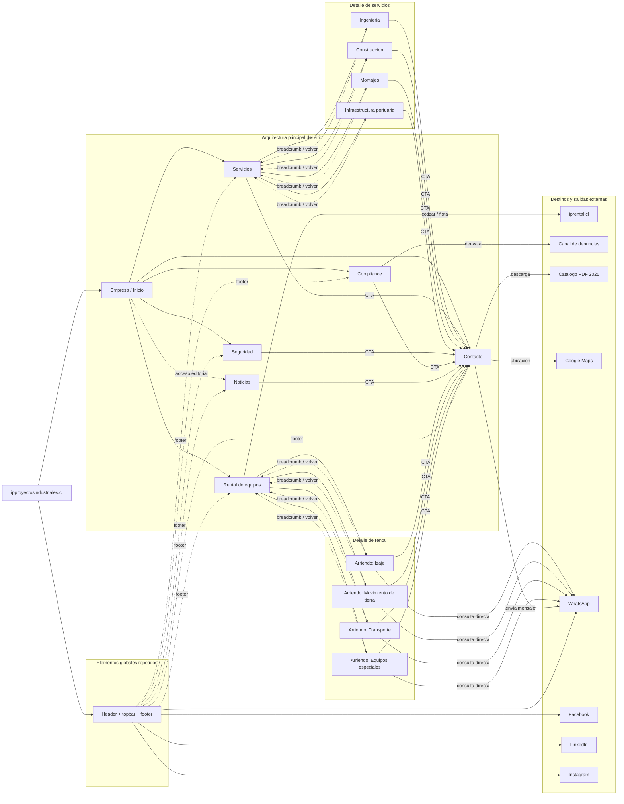

# Arquitectura de informacion y enlaces del sitio IP

Fuente analizada: HTML estatico de `IP-Sitio-Web` en el workspace vecino.

Criterio del esquema:
- Muestra la estructura principal de paginas y sus relaciones de navegacion.
- Distingue los hubs `Servicios` y `Rental de equipos` de sus paginas de detalle.
- Incluye las salidas externas confirmadas en el markup.
- No incluye enlaces placeholder con `#` de la pagina de noticias.

