# Renovación Visual Homepage — IP Rental

## Resumen Ejecutivo

Renovación visual de la homepage de **iprental.cl** inspirada en la estructura de [skrental.com](https://www.skrental.com/tiendaonline/webapp/home). El objetivo principal es **maximizar la visibilidad del catálogo de equipos en arriendo** desde el primer viewport, reestructurando las secciones superiores y reduciendo el espacio vertical del hero para que las cards de categorías sean visibles sin scroll.

---

## Problema Actual

El hero actual (`d-hero`) ocupa **70svh** con un layout split (texto izquierda + buscador derecha), consumiendo demasiado espacio vertical y empujando las cards de categorías por debajo del fold. Esto reduce la visibilidad inmediata del catálogo, que es el elemento de mayor conversión.

---

## Estructura Propuesta (nuevo orden)

| Sección | Componente | Cambio | Esfuerzo |
|---------|-----------|--------|----------|
| **§1** | Banner Promocional (slider) | **NUEVO** — Reemplaza el hero split actual | Alto |
| **§2** | Título + Subtítulo + Buscador | **REUBICADO** — Sale del hero, sección independiente compacta | Medio |
| **§3** | Category Showcase + Banner Promociones | **MODIFICADO** — Banner full-width de promos + cards compactas | Alto |
| **§4** | Logo Carousel "Confían en nosotros" | **MANTENER** sin cambios | Bajo |
| **§5** | Stats Counter | **REUBICADO** — Movido después del LogoCarousel | Bajo |
| **§6** | "También hacemos" (Servicios) | **MODIFICADO** — Cards reducidas en tamaño | Medio |
| **§7** | CTA Band | **MANTENER** sin cambios | Bajo |

> **Decisión tomada**: Stats Counter (§5) se mueve después del LogoCarousel para liberar ~90px antes del CategoryShowcase. Las stats refuerzan credibilidad DESPUÉS de mostrar catálogo + logos de clientes, no antes.

---

## Diagrama de Arquitectura Visual

```mermaid
graph TD
    subgraph "Antes (Actual)"
        A1[Hero Split<br/>70svh<br/>Texto + Buscador] --> A2[Stats Counter] --> A3[Category Showcase] --> A4[Logo Carousel] --> A5[Servicios] --> A6[CTA Band]
    end

    subgraph "Después (Propuesto)"
        B1[§1 Banner Promocional<br/>~320px] --> B2[§2 Título + Subtítulo + Buscador<br/>~160px] --> B3[§3 Category Showcase<br/>Banner Promos + Cards compactas] --> B4[§4 Logo Carousel] --> B5[§5 Stats Counter<br/>movido acá] --> B6[§6 Servicios<br/>Cards reducidas] --> B7[§7 CTA Band]
    end
```

---

## Cálculo de Visibilidad (regla de oro)

### Desktop 1080px:

| Elemento | Altura |
|----------|--------|
| TopBar + Header | ~120px |
| §1 Banner Promocional | ~320px |
| §2 SearchHero | ~160px |
| **Total hasta CategoryShowcase** | **~600px** |
| Viewport | 1080px |
| **Espacio visible para cards** | **~480px ✅** |

### Mobile 667px (iPhone SE, peor caso):

| Elemento | Altura |
|----------|--------|
| TopBar + Header | ~100px |
| §1 Banner | ~200px |
| §2 SearchHero | ~180px |
| §3 CategoryShowcase header | ~80px |
| **Total hasta primera card** | **~560px** |
| Viewport | 667px |
| **Espacio visible** | **~107px** (cards asoman, 1 swipe) |

---

## Archivos Afectados

| Archivo | Acción |
|---------|--------|
| `src/pages/index.astro` | **Modificado** — Reestructuración completa de secciones |
| `src/components/rental/CategoryShowcase.astro` | **Modificado** — Card "Promociones" + cards compactas |
| `src/components/rental/PromoBanner.astro` | **NUEVO** — Slider/banner promocional |
| `src/components/rental/SearchHero.astro` | **NUEVO** — Sección compacta título+buscador (extraído del hero) |
| `src/assets/imgs/banners/` | **NUEVO** — Imágenes promocionales del banner |
| `src/data/promotions.ts` | **NUEVO** — Datos de promociones para banner y card |

---

## Referencia Visual (skrental.com)

El sitio de referencia presenta:
- **Hero**: Slider de imágenes promocionales full-width con navegación por dots y flechas
- **Post-hero**: Buscador de equipos con título integrado
- **Catálogo**: Grid de categorías con cards que incluyen imagen, nombre y subcategorías
- **Sección "Promociones"**: Card destacada como primera opción en el catálogo
- **Confianza**: Carrusel de logos de clientes
- **Servicios**: Sección secundaria con cards más pequeñas

---

## Features Detallados

- [Banner Promocional (§1)](./features/banner-promocional.md)
- [Sección Título + Buscador (§2)](./features/seccion-titulo-buscador.md)
- [Category Showcase Renovado (§3)](./features/category-showcase-renovado.md)
- [Servicios Compacto (§6)](./features/servicios-compacto.md)

---

## Flujo de Implementación

Ver: [plans/flows/renovacion-homepage.mmd](./flows/renovacion-homepage.mmd)

---

## Decisiones Técnicas

1. **Banner slider**: Implementación con CSS crossfade + JS mínimo (sin librerías externas), respetando `prefers-reduced-motion`
2. **Datos de promociones**: Archivo estático `src/data/promotions.ts` con estructura extensible
3. **Images**: Formato AVIF/WebP con fallback, lazy loading excepto primera imagen del banner
4. **Cards compactas**: Reducción de aspect-ratio de imágenes y padding reducido
5. **Accesibilidad**: `aria-roledescription="carousel"` en el banner, `aria-live="polite"` en slides
6. **Separación visual entre secciones**: Transición directa por cambio de fondo (graphite → graphite-2 → theme-bg), sin bordes ni gaps adicionales
7. **Menú de navegación**: Sin cambios. "Promociones" no se agrega al menú hasta que exista la página dedicada `/arriendo/promociones`
8. **Header/TopBar**: Sin cambios. El banner ya contempla el `margin-top` negativo para montarse debajo del header sticky. El `z-index: 50` del header es suficiente.
9. **Performance**: Sin budget específico. Mantener LCP dentro de "Good" (<2.5s) según Core Web Vitals. CLS debe ser 0 (el banner tiene altura fija con `clamp()`).

---

## Estado: ✅ Completed

**Fecha**: 2026-09-07

### Archivos creados
- `src/data/promotions.ts` — Datos estáticos del banner (3 slides) y card de promociones
- `src/components/rental/PromoBanner.astro` — Banner crossfade con dots, swipe, keyboard, autoplay
- `src/components/rental/SearchHero.astro` — Sección de búsqueda centrada con EquipmentSearch

### Archivos modificados
- `src/components/rental/CategoryShowcase.astro` — Card Promociones full-width + grid 2×2
- `src/pages/index.astro` — Nuevo orden de secciones (§1-§7)

### Decisiones de diseño (29 preguntas resueltas)
Ver resumen en conversación de "grill-me". Todas las ramas del árbol de decisiones están resueltas.

### Notas de implementación
- El banner usa las imágenes existentes de `src/assets/imgs/hero/arriendo/` (izaje, movimiento-de-tierra, transporte)
- El PromoBanner maneja edge cases: 0 slides (no renderiza), 1 slide (banner estático sin dots ni autoplay)
- El CategoryShowcase mantiene el header centrado (eyebrow + título) con el banner de Promociones debajo
- Transición visual entre secciones por cambio de fondo (sin bordes ni gaps)
- Build verificado exitosamente
