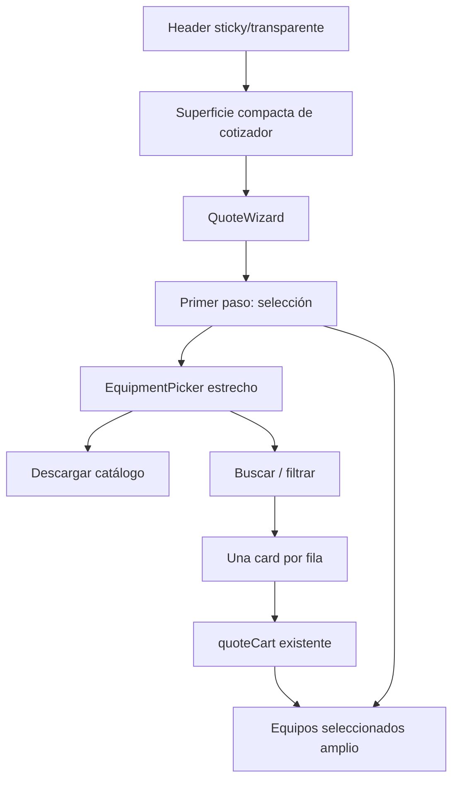

# Cotizador — refinamiento de primera pantalla

## Resumen

Este plan reorganiza la primera vista del cotizador para que el usuario llegue directamente a la tarea principal: buscar y seleccionar equipos. Se elimina el hero fotográfico como bloque protagonista, se conserva únicamente una superficie compacta que garantice contraste y estabilidad para el navbar transparente, y se desplaza la acción directa de descarga del catálogo al encabezado de “Agregar equipos”.

La selección actual tendrá mayor peso visual que el descubrimiento de equipos: en desktop se conservarán dos columnas, pero la búsqueda ocupará una columna más estrecha y los equipos seleccionados una columna más amplia. En móvil, ambas zonas se apilarán manteniendo primero la selección actual.

## Objetivos

- Reducir contenido no esencial antes de la tarea principal.
- Evitar interferencias visuales entre el navbar transparente y el contenido.
- Mantener el catálogo accesible con una acción directa y visible.
- Presentar una card de búsqueda por fila para facilitar lectura, comparación y uso del botón.
- Dar mayor superficie y jerarquía a los equipos seleccionados.

## Alcance

### Incluido

- Reemplazo visual de `QuoteHero.astro` en `/cotizador`.
- Ajuste del fondo/espacio superior para estabilizar el navbar.
- Traslado del botón “Descargar catálogo” al header de `EquipmentPicker.astro`.
- Reorganización de columnas en `QuoteStepSelect.astro`.
- Resultados de búsqueda en una sola card por fila.
- Revisión responsive, accesibilidad, estados vacíos y foco.

### No incluido

- Cambios en el modelo de carrito.
- Cambios en el flujo de datos de empresa, dirección o Google Maps.
- Cambios en el catálogo o en la fuente `RENTAL_CATEGORIES`.
- Rediseño global del header fuera de `/cotizador`.

## Dirección UX

Modo de la superficie: **Operate**.

La primera pantalla debe comunicar inmediatamente: “estoy en el cotizador, puedo buscar un equipo y revisar mi selección”. La interfaz no debe comportarse como una landing ni competir con el contenido operativo mediante una imagen hero.

## Arquitectura de alto nivel



## Documentos relacionados

- [Plan de feature](./features/cotizador-layout-refinement.md)
- [Flujo de interacción](./flows/cotizador-layout-flow.mmd)
- [Factibilidad](./reports/feasibility-report.md)
- [Esfuerzo](./reports/effort-analysis.md)
- [Consistencia visual previa](./quote-design-consistency.md)
- [Selector de equipos](./quote-cart/10-equipment-selector.md)

---

# Integración de Resend Email para Cotizaciones

## Resumen

Nueva feature para enviar correos electrónicos automáticamente después de completar una cotización utilizando la API de Resend. El correo incluirá el resumen completo de equipos seleccionados, datos de la empresa y notas globales.

## Estado

**Status**: Planned | **Esfuerzo**: Medio (2-3 días) | **Prioridad**: Alta

## Arquitectura

```mermaid
flowchart LR
    User[Usuario] --> Review[QuoteReview]
    Review --> API[/api/quote-email]
    API --> Resend[Resend API]
    Resend --> Email[Correo enviado]
    Review --> WhatsApp[WhatsApp]
```

## Documentos relacionados

- [Plan de feature](./features/resend-email-integration.md)
- [Flujo de envío](./flows/resend-email-flow.mmd)
- [Factibilidad](./reports/resend-email-feasibility.md)
- [Esfuerzo](./reports/resend-email-effort.md)

---

# Migración de Resend API a SMTP Hostinger

## Resumen

Migración del sistema de envío de correos desde la API de Resend hacia el servidor SMTP de Hostinger, utilizando la infraestructura de correo ya disponible en el hosting contratado. Se reemplaza el SDK de Resend por Nodemailer con configuración SMTP directa, eliminando la dependencia de un servicio externo.

## Estado

**Status**: Planned | **Esfuerzo**: Medio-Bajo (~2 días) | **Prioridad**: Media

## Arquitectura

```mermaid
flowchart LR
    User[Usuario] --> Review[QuoteReview]
    Review --> API[/api/quote-email]
    API --> Nodemailer[Nodemailer]
    Nodemailer --> SMTP[Hostinger SMTP]
    SMTP --> Email[Correo enviado]
    Review --> WhatsApp[WhatsApp]
```

## Documentos relacionados

- [Plan de feature](./features/smtp-migration.md)
- [Flujo de migración](./flows/smtp-migration-flow.mmd)
- [Factibilidad](./reports/smtp-migration-feasibility.md)
- [Esfuerzo](./reports/smtp-migration-effort.md)
