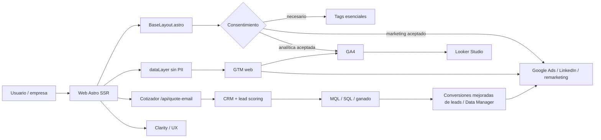

# Plan de medición, SEM y generación de leads

## Resumen ejecutivo

La web de IP Proyectos Industriales debe medir el recorrido completo de un prospecto B2B:

`anuncio o búsqueda → landing → interacción → cotización → lead contactable → oportunidad → cliente`.

Se recomienda instalar **un contenedor web de Google Tag Manager (GTM)** como punto único de
orquestación. GTM debe distribuir GA4, Google Ads y, después de validar consentimiento,
Clarity, LinkedIn Insight Tag y otras etiquetas. El objetivo no es acumular métricas, sino
optimizar inversión hacia **leads calificados**, no únicamente hacia clics o formularios.

> Este documento es un plan técnico/marketing, no asesoría jurídica. Antes de publicar tags se
> debe validar la política de privacidad, cookies y tratamiento de datos con el responsable legal.

## Contexto detectado en el repositorio

| Elemento | Estado actual | Consecuencia para el plan |
|---|---|---|
| Framework | Astro 7 + TypeScript, `output: server`, `@astrojs/node` | El HTML común se controla desde `src/layouts/BaseLayout.astro`. |
| Conversión principal | Cotizador `/cotizador` en 3 pasos | Medir avance del wizard y éxito real del envío. |
| Envío de cotización | `POST /api/quote-email`, respuesta JSON e indicador inline | `quote_submit_success` debe dispararse después de `response.ok && result.success`; `/gracias` no es actualmente la confirmación del cotizador. |
| Canales adicionales | WhatsApp, teléfono, email y catálogo PDF | Medir clics como microconversiones; una llamada real requiere call tracking. |
| Formularios alternativos | Algunos componentes apuntan a `/api/contact` | Verificar/implementar ese endpoint antes de contar sus envíos como conversiones. |
| Tags actuales | No se encontraron GTM, GA4 ni `dataLayer` | La implementación parte desde cero. |
| Consentimiento | `/cookies` es contenido placeholder | Debe existir un CMP/banner y una política coherente antes de activar marketing. |

## Objetivos y KPI

### Objetivos de negocio

1. Aumentar cotizaciones de empresas dentro de las zonas atendidas.
2. Identificar qué servicio, región, campaña y palabra clave produce oportunidades reales.
3. Reducir formularios irrelevantes mediante segmentación, campos de calificación y CRM.
4. Devolver a Google Ads el estado comercial del lead para optimizar por calidad.

### KPI recomendados

| Nivel | KPI | Uso |
|---|---|---|
| Primario | `generate_lead`/cotización enviada | Base inicial de optimización. |
| Calidad | MQL, SQL, oportunidad y cliente ganado | Sustituye el CPL aislado por calidad y valor. |
| Eficiencia | CPL, costo por MQL, costo por SQL, tasa de cierre | Decide presupuesto por campaña/servicio. |
| Funnel | `quote_add_item`, pasos vistos, abandono, `quote_submit_success` | Detecta fricción del cotizador. |
| Canales | WhatsApp, llamadas contestadas, email, PDF | Atribuye conversiones que no pasan por el formulario. |

## Diferenciación frente al mercado

La revisión pública de referentes muestra dos patrones:

- **Finning Chile** compite con marca, amplitud de catálogo, arriendo, soporte y cobertura,
  además de múltiples puntos de contacto.
- **Salfa** combina maquinaria, arriendo, convenios empresa, sucursales y formularios de
  contacto; su ventaja es escala y disponibilidad de canales.

La oportunidad de IP Proyectos Industriales no es imitar ese volumen, sino comunicar y medir
mejor una propuesta especializada: **arriendo de equipos + ingeniería, construcción,
montajes y soporte para proyectos industriales**, con cobertura del norte, calificación
empresa/RUT y contexto de faena en el cotizador. El CRM y las conversiones offline convierten
esa información en una ventaja medible.

## Arquitectura de alto nivel

## Fases propuestas

| Fase | Resultado | Esfuerzo |
|---|---|---|
| 0. Medición y privacidad | Inventario, cuentas, CMP, política y nombres | Medium |
| 1. Núcleo GTM + GA4 | Contenedor, dataLayer, eventos y QA | Medium |
| 2. SEM medible | Google Ads, conversiones, UTM, Search Console | Medium |
| 3. Calidad comercial | CRM, scoring, GCLID/UTM y estados | High |
| 4. Optimización multicanal | Call tracking, LinkedIn ABM, Clarity y dashboards | High |
| 5. Escala | Conversiones mejoradas de leads y GTM server-side si el volumen lo justifica | Very High |

## Decisiones pendientes

1. ¿Existen ya cuentas de GTM, GA4, Google Ads y Search Console? ¿Quién será propietario de cada una?
2. ¿Cuál es el presupuesto mensual de SEM y cuáles regiones/servicios tienen prioridad comercial?
3. ¿Qué CRM usa el equipo o cuál está dispuesto a adoptar?
4. ¿Qué estados y valores definen un MQL, SQL, oportunidad y cliente ganado?
5. ¿Se requiere un CMP administrado o se autoriza un componente propio revisado legalmente?

## Documentos relacionados

- [Plan de la feature GTM](./gtm-analytics/feature-plan.md)
- [Implementación de GTM](./gtm-analytics/gtm-implementation.md)
- [Plan de eventos](./gtm-analytics/event-tracking-plan.md)
- [Herramientas recomendadas](./gtm-analytics/recommended-tools.md)
- [Estrategia SEM](./gtm-analytics/sem-strategy.md)
- [Consentimiento](./gtm-analytics/consent-management.md)
- [Stack propuesto](./tech-stack.md)
- [Factibilidad](./reports/gtm-feasibility-report.md)
- [Esfuerzo](./reports/gtm-effort-analysis.md)
- [Flujo principal](./flows/gtm-lead-measurement.mmd)

## Fuentes consultadas

- [Google Tag Manager: crear cuenta y contenedor](https://support.google.com/tagmanager/answer/14842164)
- [Google: Consent Mode para sitios web](https://developers.google.com/tag-platform/security/guides/consent)
- [GA4: medición mejorada](https://support.google.com/analytics/answer/9216061?hl=es)
- [Google Ads: conversiones mejoradas de clientes potenciales](https://support.google.com/google-ads/answer/11347292?hl=es)
- [Google Search Console](https://search.google.com/search-console/about)
- [Microsoft Clarity](https://clarity.microsoft.com/)
- [LinkedIn Ads](https://www.linkedin.com/advertise/ads)
- [Finning Chile](https://www.finning.com/es_CL)
- [Salfa Rent](https://www.salfarent.cl/)
