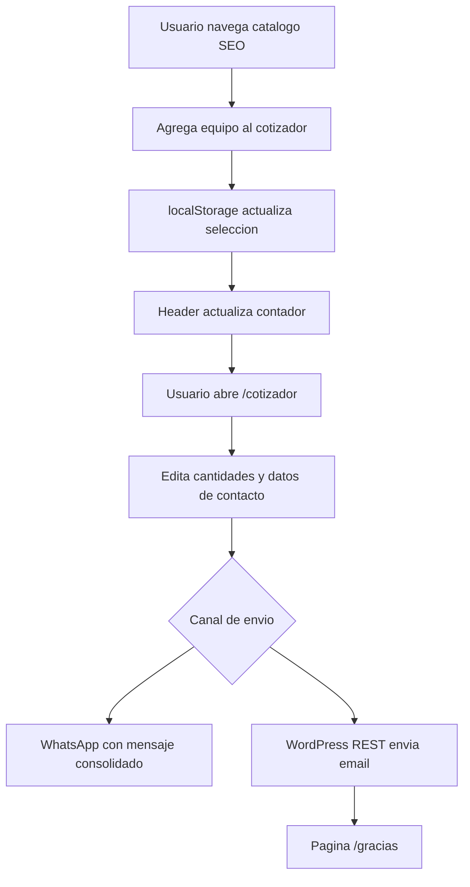
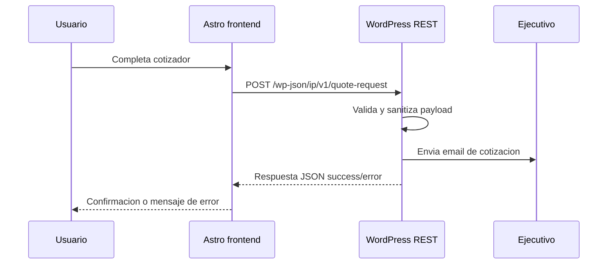

# Analisis del pivote a carrito cotizador

## 1. Resumen ejecutivo

El pivote desde un formulario simple de cotizacion hacia un "carrito cotizador" es coherente con el objetivo comercial del sitio: captar leads de usuarios que exploran maquinaria, comparar alternativas y enviar una solicitud consolidada por correo o WhatsApp a un ejecutivo. No se trata de e-commerce porque no habra compra, pago, usuarios logueados, stock transaccional ni checkout; corresponde a una capa de seleccion y envio de requerimientos.

La tecnologia actual es adecuada para el pivote si se mantiene el alcance como cotizador liviano:

- Astro estatico sigue siendo correcto para SEO, velocidad, Core Web Vitals y generacion de paginas de catalogo.
- WordPress Headless es adecuado como backend de contenido y tambien puede asumir el envio seguro de cotizaciones por email mediante un endpoint REST propio.
- No es necesario incorporar React, Vue o un framework SPA para la primera version. El estado del cotizador puede resolverse con TypeScript/JavaScript liviano, `localStorage` y componentes Astro.
- El punto critico no es el frontend, sino la decision de backend para el envio por correo: un sitio Astro `output: 'static'` no puede procesar emails por si mismo en runtime.

La recomendacion es implementar el pivote en dos etapas: primero un MVP con carrito local y envio por WhatsApp; luego agregar envio por email mediante WordPress REST, con validacion, antispam y almacenamiento opcional de leads.

## 2. Estado actual del proyecto

### 2.1 Arquitectura existente

El proyecto actual usa:

- Astro 7 con salida estatica (`output: 'static'`).
- `@astrojs/sitemap` para sitemap y canonicals.
- Tailwind CSS instalado via Vite, aunque la UI actual tambien usa CSS por componente.
- Catalogo de arriendo centralizado en `src/data/rental.ts`.
- Componentes de catalogo en `src/components/rental/`.
- WordPress REST planificado como backend headless, con cliente stub en `src/lib/wordpress.ts`.
- Despliegue estatico en Hostinger mediante `npm run deploy`.

### 2.2 Flujo de cotizacion actual

El flujo actual esta orientado a CTA unitario:

1. Usuario navega una pagina de arriendo.
2. Ve una grilla de equipos.
3. Cada `EquipmentCard` genera un link directo de WhatsApp con el mensaje especifico del equipo.
4. El usuario cotiza un equipo a la vez.

Este flujo es simple y barato, pero queda corto cuando el usuario quiere comparar o solicitar varios equipos en una sola conversacion.

### 2.3 Base tomada desde SK Rental

La pagina `www.skrental.com/tiendaonline/webapp/carro` funciona como referencia conceptual, no como copia literal. Los elementos relevantes observados son:

- Estado de carro vacio: "Tu carro esta vacio".
- Busqueda o exploracion lateral por categorias.
- Accion de agregar equipo al cotizador.
- Enfasis en cotizacion, no en compra.
- No requiere pago para avanzar.
- El carro actua como agrupador de equipos seleccionados.

Para IP Proyectos Industriales conviene adaptar esta logica a un sitio mas liviano, SEO-first y sin cuenta de usuario.

## 3. Alcance funcional recomendado

### 3.1 Version MVP

La primera version deberia incluir:

- Boton "Agregar al cotizador" en cada equipo del catalogo.
- Contador persistente en header o boton flotante.
- Vista `/cotizador` o panel lateral con equipos seleccionados.
- Edicion de cantidad por equipo.
- Eliminacion de equipos.
- Campo opcional de observaciones por equipo o por solicitud.
- Formulario de datos del solicitante:
  - nombre
  - empresa
  - telefono
  - email
  - comuna/region o zona de faena
  - fecha estimada de inicio
  - mensaje adicional
- Envio por WhatsApp con mensaje prearmado que resuma todos los equipos.
- Estado vacio con CTA para volver al catalogo `/arriendo/`.

### 3.2 Version recomendada de produccion

Ademas del MVP, la version robusta deberia agregar:

- Envio por correo a ejecutivo mediante endpoint WordPress REST.
- Confirmacion visual de envio exitoso.
- Redireccion opcional a `/gracias`.
- Copia al cliente, si se confirma que el email ingresado es valido.
- Protecciones antispam: honeypot, rate limiting, validacion server-side y, si es necesario, Turnstile o reCAPTCHA.
- Registro de cotizacion como Custom Post Type en WordPress o como entrada en una tabla propia.
- Parametros UTM y pagina de origen para atribucion comercial.

### 3.3 Fuera de alcance inicial

No deberia incluirse en la primera version:

- Login de usuarios.
- Precios publicos o calculadora de precio final.
- Pago online.
- Inventario en tiempo real.
- Workflow completo de CRM.
- Portal de seguimiento de cotizaciones.
- Integracion con ERP.

Estos puntos elevan el costo y convierten el cotizador en una aplicacion operacional, no solo en una herramienta de captacion.

## 4. Costo del pivote

Las estimaciones siguientes son de esfuerzo tecnico relativo. No incluyen tarifa monetaria porque depende del valor hora del equipo, disponibilidad de contenido, QA externo y definiciones comerciales pendientes.

| Escenario | Alcance | Esfuerzo estimado | Riesgo | Recomendacion |
|---|---|---:|---|---|
| MVP WhatsApp | Carrito local + mensaje WhatsApp consolidado | 16-28 h | Bajo | Buen primer hito para validar demanda |
| MVP WhatsApp + email basico | Carrito local + `mailto:` o servicio externo simple | 24-40 h | Medio | Util solo si se acepta una solucion transitoria |
| Produccion recomendada | Carrito local + WordPress REST + email seguro + antispam | 48-80 h | Medio | Mejor equilibrio para negocio y mantenimiento |
| Produccion avanzada | Todo lo anterior + registro en WP + panel admin + UTM + copia cliente | 80-140 h | Medio/alto | Conveniente cuando el volumen de leads lo justifique |
| Cotizador tipo app | Inventario, reglas, disponibilidad, CRM/ERP, estados | 160+ h | Alto | No recomendado para este pivote inicial |

### 4.1 Costo tecnico real del cambio

El costo del pivote no esta en cambiar las paginas SEO ya creadas, sino en agregar una capa transversal de interaccion:

- Estado compartido entre multiples paginas del catalogo.
- Persistencia local para que el usuario no pierda su seleccion.
- UI de resumen y edicion.
- Generacion confiable de mensajes para WhatsApp.
- Backend de email y seguridad antispam.
- QA de flujos moviles, porque gran parte del contacto por WhatsApp ocurrira desde celular.

### 4.2 Impacto sobre lo ya construido

El impacto sobre la arquitectura actual es bajo a medio:

- `src/data/rental.ts` puede seguir siendo la fuente de verdad del catalogo.
- `EquipmentCard.astro` debe cambiar su CTA desde "Cotizar este equipo" directo a WhatsApp hacia "Agregar al cotizador".
- `EquipmentCatalog.astro` puede mantenerse como grilla principal.
- El header debe incorporar contador o acceso al cotizador.
- Se debe crear una nueva ruta `/cotizador` o un drawer global.
- Para email real, se necesita implementar backend en WordPress o cambiar la salida Astro a SSR con adapter Node. La opcion WordPress mantiene mejor la arquitectura actual.

## 5. Evaluacion de tecnologias actuales

### 5.1 Astro

Astro sigue siendo una buena eleccion porque el nucleo del sitio es SEO, contenido y rendimiento. El cotizador necesita interactividad, pero no una SPA completa.

Uso recomendado:

- Mantener `output: 'static'` para paginas SEO y despliegue simple.
- Usar scripts TypeScript livianos en componentes Astro para el estado del cotizador.
- Evitar hidratar un framework completo salvo que el flujo crezca a filtros complejos, comparadores o reglas avanzadas.

Conclusion: adecuado.

### 5.2 WordPress Headless

WordPress es adecuado si cumple dos roles:

- CMS para noticias, paginas y contenido editable.
- Backend seguro para recibir solicitudes de cotizacion y enviar emails.

Para el segundo rol se recomienda un plugin pequeno propio, no depender de formularios pegados en el frontend. El plugin deberia exponer un endpoint REST como:

```text
POST /wp-json/ip/v1/quote-request
```

Responsabilidades del endpoint:

- Validar campos requeridos.
- Sanitizar datos.
- Verificar honeypot/rate limit/captcha si aplica.
- Generar email interno para el ejecutivo.
- Opcionalmente guardar la cotizacion como Custom Post Type `quote_request`.
- Retornar estado JSON al frontend.

Conclusion: adecuado, con implementacion backend especifica.

### 5.3 Hostinger y despliegue estatico

El despliegue actual es adecuado para el frontend estatico. La limitacion es que no permite que Astro procese emails si se mantiene `output: 'static'`.

Opciones:

1. Mantener Astro estatico y delegar email a WordPress REST. Recomendado.
2. Migrar Astro a SSR con `@astrojs/node` y crear endpoint propio. Posible, pero aumenta complejidad de deploy y operacion.
3. Usar servicio externo de formularios. Rapido, pero introduce dependencia y costo potencial.

Conclusion: mantener despliegue estatico y resolver backend en WordPress.

### 5.4 JavaScript client-side

El carrito requiere estado en navegador. Para el alcance actual basta con JavaScript/TypeScript propio.

Persistencia recomendada:

```text
localStorage key: ip_quote_cart_v1
```

Modelo sugerido:

```typescript
interface QuoteCartItem {
  equipmentSlug: string;
  name: string;
  categorySlug: string;
  subcategorySlug: string;
  capacity?: string;
  height?: string;
  quantity: number;
  notes?: string;
  sourceUrl: string;
}

interface QuoteCart {
  version: 1;
  updatedAt: string;
  items: QuoteCartItem[];
}
```

Conclusion: adecuado, sin framework adicional en v1.

## 6. Arquitectura propuesta

### 6.1 Componentes frontend

```text
src/
+-- components/
|   +-- quote/
|   |   +-- QuoteAddButton.astro
|   |   +-- QuoteCartBadge.astro
|   |   +-- QuoteCartDrawer.astro        # opcional si se usa panel lateral
|   |   +-- QuoteCartSummary.astro
|   |   +-- QuoteRequestForm.astro
|   +-- rental/
|       +-- EquipmentCard.astro          # cambia CTA unitario por add-to-cart
+-- lib/
|   +-- quoteCart.ts                     # estado localStorage + eventos
|   +-- quoteMessage.ts                  # armado de WhatsApp/email payload
+-- pages/
|   +-- cotizador.astro
+-- types/
  +-- quote.ts
```

### 6.2 Flujo frontend



### 6.3 Flujo backend recomendado



## 7. Paso a paso de gestion de la feature

### Fase 0 - Definicion funcional

Duracion sugerida: 0.5-1 dia.

Tareas:

1. Confirmar datos minimos que necesita el ejecutivo para cotizar.
2. Confirmar numero WhatsApp final y correos destino.
3. Definir si se guardaran cotizaciones en WordPress o solo se enviaran por email.
4. Definir campos obligatorios y opcionales.
5. Definir mensaje estandar de WhatsApp.
6. Confirmar texto legal de privacidad y consentimiento.

Criterio de salida:

- Documento corto de campos, destinatarios y flujo aprobado.

### Fase 1 - Modelo de datos del cotizador

Duracion sugerida: 0.5-1 dia.

Tareas:

1. Crear `src/types/quote.ts`.
2. Crear helper para aplanar equipos desde `src/data/rental.ts`.
3. Agregar al item de cotizacion los slugs de categoria/subcategoria.
4. Definir versionado de `localStorage`.
5. Definir payload comun para WhatsApp y email.

Criterio de salida:

- Existe un contrato claro entre tarjetas, pagina `/cotizador` y backend.

### Fase 2 - Interaccion de carrito en frontend

Duracion sugerida: 1-2 dias.

Tareas:

1. Reemplazar CTA directo en `EquipmentCard.astro` por `QuoteAddButton`.
2. Implementar `src/lib/quoteCart.ts` con add/remove/update/clear.
3. Agregar eventos custom para sincronizar contador entre componentes.
4. Agregar `QuoteCartBadge` en header o navegacion.
5. Crear estado de feedback: agregado, ya agregado, error localStorage.

Criterio de salida:

- El usuario puede seleccionar equipos desde cualquier pagina de catalogo y mantener la seleccion al navegar.

### Fase 3 - Pagina `/cotizador`

Duracion sugerida: 1-2 dias.

Tareas:

1. Crear `src/pages/cotizador.astro`.
2. Renderizar estado vacio con CTA a `/arriendo/`.
3. Mostrar lista de equipos seleccionados.
4. Permitir editar cantidad y notas.
5. Mostrar formulario de datos del solicitante.
6. Construir link WhatsApp consolidado.
7. Validar UX mobile.

Criterio de salida:

- El usuario puede armar una cotizacion multi-equipo y enviarla por WhatsApp.

### Fase 4 - Envio por email via WordPress

Duracion sugerida: 2-4 dias.

Tareas:

1. Crear plugin WordPress propio para endpoint de cotizaciones.
2. Implementar `POST /wp-json/ip/v1/quote-request`.
3. Validar payload en servidor.
4. Sanitizar todos los campos.
5. Enviar email a ejecutivo con resumen estructurado.
6. Agregar honeypot y rate limit.
7. Definir si se guarda Custom Post Type `quote_request`.
8. Conectar `QuoteRequestForm` con el endpoint.
9. Manejar success/error en frontend.

Criterio de salida:

- El canal email funciona sin exponer credenciales en el frontend y sin depender de `mailto:`.

### Fase 5 - SEO, analitica y medicion

Duracion sugerida: 0.5-1 dia.

Tareas:

1. Marcar `/cotizador` como `noindex` si el contenido es dinamico o escaso.
2. Mantener indexables las paginas de catalogo `/arriendo/*`.
3. Agregar eventos de analytics:
   - `quote_add_item`
   - `quote_remove_item`
   - `quote_submit_whatsapp`
   - `quote_submit_email`
4. Propagar UTM/source URL al payload.
5. Revisar sitemap para excluir rutas transaccionales no utiles.

Criterio de salida:

- El pivote mejora conversion sin diluir la arquitectura SEO.

### Fase 6 - QA y salida a produccion

Duracion sugerida: 1 dia.

Tareas:

1. Probar flujo en desktop y mobile.
2. Probar persistencia entre paginas.
3. Probar carro vacio.
4. Probar caracteres especiales y tildes en WhatsApp/email.
5. Probar limites de mensaje WhatsApp con multiples equipos.
6. Probar errores de endpoint WordPress.
7. Ejecutar `npm run build`.
8. Verificar deploy estatico.

Criterio de salida:

- Feature validada con checklist funcional y build correcto.

## 8. Decisiones pendientes

Antes de implementar conviene cerrar estas decisiones:

| Decision | Opciones | Recomendacion |
|---|---|---|
| Ruta del cotizador | `/cotizador`, `/cotizar`, `/carro` | `/cotizador` por claridad SEO/comercial |
| Canal principal | WhatsApp, email, ambos | Ambos, con WhatsApp como MVP |
| Backend email | WordPress REST, Astro SSR, servicio externo | WordPress REST |
| Guardar leads | No guardar, guardar en WP, enviar a CRM | Guardar en WP si habra seguimiento comercial |
| Antispam | Honeypot, Turnstile, reCAPTCHA | Honeypot + rate limit al inicio |
| Contador global | Header, floating button, ambos | Header + boton flotante mobile |
| Mensaje por equipo | Libre, estructurado | Estructurado para que el ejecutivo procese rapido |

## 9. Riesgos y mitigaciones

| Riesgo | Impacto | Mitigacion |
|---|---|---|
| WhatsApp limita mensajes largos | Medio | Resumir equipos y pedir confirmacion; para muchos items priorizar email |
| `localStorage` no disponible | Bajo | Fallback con mensaje y CTA directo a WhatsApp |
| Spam en endpoint email | Alto | Honeypot, rate limit, validacion server-side, captcha si aumenta abuso |
| Cotizaciones incompletas | Medio | Campos requeridos minimos y placeholders claros |
| Doble fuente de verdad del catalogo | Medio | Mantener `src/data/rental.ts` como fuente unica hasta integrar WordPress |
| Dependencia futura de WordPress | Medio | Definir contrato REST estable y versionado `/ip/v1/` |
| Degradacion SEO por JS | Bajo | Las paginas de catalogo siguen estaticas; el JS solo afecta conversion |

## 10. Criterios de aceptacion

La feature puede considerarse lista cuando se cumpla:

- Un usuario puede agregar al menos 2 equipos desde paginas distintas del catalogo.
- El contador del cotizador refleja correctamente la cantidad seleccionada.
- La seleccion persiste al recargar la pagina.
- `/cotizador` muestra estado vacio y estado con items.
- El usuario puede modificar cantidad y eliminar items.
- WhatsApp abre con mensaje consolidado y legible.
- El formulario valida campos requeridos antes de enviar email.
- El email llega al ejecutivo con datos del cliente y equipos seleccionados.
- No se exponen credenciales ni emails SMTP en el frontend.
- El build `npm run build` termina correctamente.
- Las paginas SEO existentes de `/arriendo/*` siguen indexables y sin cambios de URL.

## 11. Recomendacion final

El pivote es conveniente y no obliga a reemplazar la arquitectura actual. La mejor estrategia es mantener Astro como frontend SEO-first y usar WordPress Headless tambien como receptor seguro de cotizaciones. El costo incremental es razonable si el alcance se controla: primero carrito local y WhatsApp, luego email via WordPress REST.

La decision mas importante es evitar convertir este modulo en e-commerce. Mientras se mantenga como cotizador sin usuarios, sin pagos y sin inventario en tiempo real, el proyecto puede avanzar con baja complejidad, buen rendimiento y una experiencia comercial bastante mas solida que el formulario simple original.