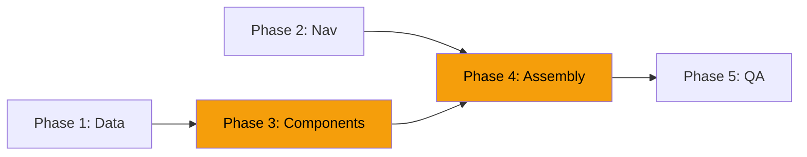

# Effort Analysis — Rental-First Homepage Remake

## Task Breakdown

### Phase 1: Data & Configuration Changes

| # | Task | File(s) | Effort | Duration | Dependencies |
|---|------|---------|--------|----------|--------------|
| 1.1 | Update `siteBrand` tagline and description | `src/data/site.ts` | Low | 15 min | None |
| 1.2 | Reorder `navigationData` (Arriendo first) | `src/data/site.ts` | Low | 10 min | None |
| 1.3 | Reorder `footerData` columns | `src/data/site.ts` | Low | 10 min | None |
| 1.4 | Add "Cotizador" link to `topbarData` | `src/data/site.ts` | Low | 5 min | None |
| 1.5 | Add `featuredEquipment` data array | `src/data/site.ts` or new file | Low | 30 min | None |
| 1.6 | Add category hero images to `rental.ts` (if not already present) | `src/data/rental.ts` | Low | 20 min | None |

**Phase 1 Total: ~1.5 hours | Effort: Low**

---

### Phase 2: Navigation & Header Changes

| # | Task | File(s) | Effort | Duration | Dependencies |
|---|------|---------|--------|----------|--------------|
| 2.1 | Add CTA button slot to `Header.astro` | `src/components/layout/Header.astro` | Low | 30 min | None |
| 2.2 | Render "Cotizar" button in `BaseLayout.astro` header | `src/layouts/BaseLayout.astro` | Low | 15 min | 2.1 |
| 2.3 | Update breadcrumb label "Empresa" → "Inicio" across rental pages | `src/pages/arriendo/**/*.astro` | Low | 20 min | None |

**Phase 2 Total: ~1 hour | Effort: Low**

---

### Phase 3: New Components

| # | Task | File(s) | Effort | Duration | Dependencies |
|---|------|---------|--------|----------|--------------|
| 3.1 | Build `EquipmentSearch.astro` — markup + styling | `src/components/rental/EquipmentSearch.astro` | Medium | 2 hours | 1.6 |
| 3.2 | Build `EquipmentSearch` — client-side search logic | Same | Medium | 2 hours | 3.1 |
| 3.3 | Build `EquipmentSearch` — keyboard nav + a11y | Same | Medium | 1 hour | 3.2 |
| 3.4 | Build `CategoryShowcase.astro` — markup + responsive grid | `src/components/rental/CategoryShowcase.astro` | Medium | 2 hours | 1.6 |
| 3.5 | Build `CategoryShowcase` — subcategory pills + links | Same | Low | 1 hour | 3.4 |
| 3.6 | Build `FeaturedEquipment.astro` — carousel + scroll snap | `src/components/rental/FeaturedEquipment.astro` | Medium | 2 hours | 1.5 |
| 3.7 | Build `FeaturedEquipment` — badge + EquipmentCard integration | Same | Low | 1 hour | 3.6 |
| 3.8 | Build `CoverageSection.astro` — geographic zones list | `src/components/ui/CoverageSection.astro` | Low | 1 hour | None |
| 3.9 | Build `ServicesCompact.astro` — markup + responsive grid | `src/components/ui/ServicesCompact.astro` | Low | 1.5 hours | None |
| 3.10 | Add missing icons to `icons.ts` (search, blueprint, building, anchor) | `src/lib/icons.ts` | Low | 30 min | None |

**Phase 3 Total: ~14.5 hours (~2 days) | Effort: Medium-High**

---

### Phase 4: Homepage Assembly

| # | Task | File(s) | Effort | Duration | Dependencies |
|---|------|---------|--------|----------|--------------|
| 4.1 | Rewrite `index.astro` — remove old sections (hero, SplitSections, ServicesGrid, NewsGrid) | `src/pages/index.astro` | Medium | 1 hour | Phase 3 |
| 4.2 | Rewrite `index.astro` — add new hero with EquipmentSearch | Same | Medium | 1.5 hours | 3.3 |
| 4.3 | Rewrite `index.astro` — add CategoryShowcase section | Same | Low | 30 min | 3.5 |
| 4.4 | Rewrite `index.astro` — add FeaturedEquipment section | Same | Low | 30 min | 3.7 |
| 4.5 | Rewrite `index.astro` — update StatsCounter props | Same | Low | 15 min | None |
| 4.6 | Rewrite `index.astro` — add CoverageSection | Same | Low | 15 min | 3.8 |
| 4.7 | Rewrite `index.astro` — add ServicesCompact section | Same | Low | 15 min | 3.9 |
| 4.8 | Rewrite `index.astro` — update CTABand props | Same | Low | 15 min | None |
| 4.9 | Update page title, meta description, JSON-LD | Same | Low | 30 min | 1.1 |
| 4.10 | Update hero image/video assets (new rental-focused image) | `src/assets/` | Medium | 1 hour | None |
| 4.11 | Responsive QA — mobile, tablet, desktop | All | Medium | 2 hours | 4.1-4.9 |

**Phase 4 Total: ~8 hours (~1 day) | Effort: Medium**

---

### Phase 5: Category Hub Improvement

| # | Task | File(s) | Effort | Duration | Dependencies |
|---|------|---------|--------|----------|--------------|
| 5.1 | Redesign `/arriendo/index.astro` — add category images | `src/pages/arriendo/index.astro` | Medium | 2 hours | 1.6 |
| 5.2 | Redesign `/arriendo/index.astro` — improve card layout (currently text-only) | Same | Medium | 2 hours | 5.1 |
| 5.3 | Redesign `/arriendo/index.astro` — responsive QA | Same | Low | 1 hour | 5.2 |

**Phase 5 Total: ~5 hours | Effort: Medium**

---

### Phase 6: QA & SEO Validation

| # | Task | File(s) | Effort | Duration | Dependencies |
|---|------|---------|--------|----------|--------------|
| 6.1 | Run `astro build` — verify no errors | Terminal | Low | 15 min | Phase 4, 5 |
| 6.2 | Validate all internal links work | Browser | Low | 30 min | 6.1 |
| 6.3 | Validate SEO meta tags (title, description, OG) | Browser devtools | Low | 30 min | 4.9 |
| 6.4 | Validate JSON-LD schemas render correctly | Google Rich Results Test | Low | 20 min | 4.9 |
| 6.5 | Lighthouse audit — target 90+ Performance, 95+ SEO | Lighthouse | Low | 30 min | 6.1 |
| 6.6 | Test EquipmentSearch with various queries | Browser | Low | 30 min | 3.3 |
| 6.7 | Test quote cart flow end-to-end (homepage → cotizador) | Browser | Low | 30 min | Phase 4 |
| 6.8 | Cross-browser check (Chrome, Firefox, Safari) | Browser | Low | 30 min | Phase 4 |

**Phase 6 Total: ~3.5 hours | Effort: Low**

---

## Summary

| Phase | Tasks | Total Duration | Effort Level |
|-------|-------|---------------|--------------|
| **Phase 1**: Data & Config | 6 tasks | ~1.5 hours | Low |
| **Phase 2**: Navigation | 3 tasks | ~1 hour | Low |
| **Phase 3**: New Components | 10 tasks | ~14.5 hours | Medium-High |
| **Phase 4**: Homepage Assembly | 11 tasks | ~8 hours | Medium |
| **Phase 5**: Category Hub | 3 tasks | ~5 hours | Medium |
| **Phase 6**: QA & SEO | 8 tasks | ~3.5 hours | Low |
| **TOTAL** | **41 tasks** | **~33.5 hours** | **Medium-High** |

### Estimated Calendar Time
- **Solo developer, focused**: 5-6 working days
- **Solo developer, part-time**: 8-12 working days
- **With parallel work** (Phase 1+2 can run parallel with Phase 3): 4-5 working days

---

## Critical Path

The **critical path** runs through Phase 3 (new components) → Phase 4 (homepage assembly). Phases 1 and 2 are independent and can be done first or in parallel.

---

## Risk-Adjusted Estimates

| Risk | Probability | Impact | Buffer |
|------|------------|--------|--------|
| EquipmentSearch takes longer (edge cases, a11y) | Medium | +3 hours | Add 1 day |
| Hero image asset not available | Low | +2 hours | Use existing image as placeholder |
| Responsive issues in CategoryShowcase | Medium | +2 hours | Add 0.5 day |
| Build errors from component changes | Low | +1 hour | Fix during Phase 5 |

**Recommended buffer**: Add 1-2 days to the estimate for a total of **5-7 working days**.

---

## What's NOT Included (Explicitly Excluded)

| Item | Reason | Future Phase |
|------|--------|--------------|
| Changes to `/arriendo/*` subcategory pages | Already well-structured | N/A |
| Changes to `/servicios/*` pages | Demoted but not modified | N/A |
| Changes to `/cotizador` quote wizard | Works as-is | N/A |
| WordPress integration | Deferred per global spec | Post-MVP |
| New hero video production | Use existing images | Future |
| A/B testing homepage variants | Requires analytics setup | Post-launch |
| Server-side search (Algolia, etc.) | Overkill for ~40 items | If catalog grows 10x |
