# Análisis de Esfuerzo — Renovación Visual Homepage

## Resumen de Esfuerzo por Feature

| Feature | Componente | Esfuerzo | Estimación | Dependencias |
|---------|-----------|----------|-----------|--------------|
| **§1** Banner Promocional | `PromoBanner.astro` (NUEVO) | 🔴 Alto | 1.5-2 días | `promotions.ts`, imágenes |
| **§2** Título + Buscador | `SearchHero.astro` (NUEVO) | 🟡 Medio | 0.5-1 día | `EquipmentSearch.astro` |
| **§3** Stats Counter | Sin cambios | 🟢 Bajo | 0 | — |
| **§4** Category Showcase | `CategoryShowcase.astro` (MOD) | 🔴 Alto | 1.5-2 días | `promotions.ts` |
| **§5** Logo Carousel | Sin cambios | 🟢 Bajo | 0 | — |
| **§6** Servicios Compacto | CSS en `index.astro` (MOD) | 🟡 Medio | 0.5 día | — |
| **§7** CTA Band | Sin cambios | 🟢 Bajo | 0 | — |
| — | Preparación datos/imágenes | 🟡 Medio | 0.5 día | — |
| — | Integración + cleanup | 🟡 Medio | 0.5-1 día | Todas las anteriores |
| — | Testing integral | 🟡 Medio | 1 día | Todas las anteriores |

---

## Desglose Detallado de Tareas

### Fase 1 — Preparación

| Tarea | Esfuerzo | Tiempo | Notas |
|-------|----------|--------|-------|
| Crear `src/data/promotions.ts` | 🟢 Bajo | 1h | Modelo + datos iniciales |
| Preparar imágenes del banner (3-5) | 🟢 Bajo | 1h | AVIF, 1920×540, optimizadas |
| Imagen card Promociones | 🟢 Bajo | 0.5h | AVIF, mismo ratio que categories |

**Subtotal: ~2.5h**

### Fase 2 — Componentes Nuevos

| Tarea | Esfuerzo | Tiempo | Notas |
|-------|----------|--------|-------|
| Estructura HTML `PromoBanner.astro` | 🟡 Medio | 2h | Semántica, aria-labels |
| CSS `PromoBanner` responsive | 🟡 Medio | 2h | `clamp()`, overflow, transitions |
| JS slider (autoplay, dots, flechas) | 🔴 Alto | 3h | Vanilla JS, pause on hover, reduced-motion |
| Crear `SearchHero.astro` | 🟡 Medio | 2h | Extraer del hero actual + adaptar |
| CSS SearchHero compacto | 🟢 Bajo | 1h | Clamp font-size, padding reducido |

**Subtotal: ~10h**

### Fase 3 — Modificaciones

| Tarea | Esfuerzo | Tiempo | Notas |
|-------|----------|--------|-------|
| Card "Promociones" en CategoryShowcase | 🟡 Medio | 3h | Nuevo item, badge, datos |
| CSS compacto para cards de categoría | 🟡 Medio | 2h | Aspect-ratio, padding, clamp |
| Grid adjustment (5 items en 2 col) | 🟢 Bajo | 1h | Último item full-width o centrado |
| CSS compacto para service-cards | 🟢 Bajo | 2h | Aspect-ratio 4:3, clamp, padding |

**Subtotal: ~8h**

### Fase 4 — Integración

| Tarea | Esfuerzo | Tiempo | Notas |
|-------|----------|--------|-------|
| Reestructurar `index.astro` | 🟡 Medio | 2h | Eliminar d-hero, importar nuevos components |
| Cleanup CSS hero viejo | 🟢 Bajo | 1h | Eliminar estilos `.d-hero*` |
| Actualizar preloads y meta | 🟢 Bajo | 0.5h | Banner img → preload |
| Verificar h1 único | 🟢 Bajo | 0.5h | Solo en SearchHero |

**Subtotal: ~4h**

### Fase 5 — Testing

| Tarea | Esfuerzo | Tiempo | Notas |
|-------|----------|--------|-------|
| Responsive testing (4 breakpoints) | 🟡 Medio | 2h | Visual regression |
| Accesibilidad testing | 🟡 Medio | 1.5h | Keyboard, screen reader, reduced-motion |
| Performance testing (Lighthouse) | 🟢 Bajo | 1h | LCP, CLS targets |
| Cross-browser testing | 🟢 Bajo | 1h | Chrome, Firefox, Safari |
| Verificar "above the fold" | 🟢 Bajo | 0.5h | Cards visibles sin scroll |

**Subtotal: ~6h**

---

## Total Estimado

| Categoría | Horas | Días (8h/día) |
|-----------|-------|---------------|
| Preparación | 2.5h | 0.3 |
| Componentes nuevos | 10h | 1.25 |
| Modificaciones | 8h | 1 |
| Integración | 4h | 0.5 |
| Testing | 6h | 0.75 |
| **TOTAL** | **30.5h** | **~3.8 días** |

**Estimación con buffer (20%): ~4.5 días**

---

## Ruta Crítica

```mermaid
gantt
    title Ruta Crítica — Renovación Homepage
    dateFormat HH:mm
    axisFormat %H:%M

    section Preparación
    promotions.ts + imágenes         :p1, 00:00, 3h

    section Componentes
    PromoBanner.astro (slider)       :p2, after p1, 7h
    SearchHero.astro                 :p3, after p2, 3h

    section Modificaciones
    CategoryShowcase (Promos+compact):p4, after p1, 6h
    Servicios compacto               :p5, after p4, 2h

    section Integración
    Reestructurar index.astro        :p6, after p3, 4h

    section Testing
    Testing integral                 :p7, after p6, 6h
```

### Camino Crítico

1. **`promotions.ts`** → debe estar listo antes de `PromoBanner` y `CategoryShowcase`
2. **`PromoBanner.astro`** → el componente más complejo (slider JS)
3. **`SearchHero.astro`** → depende de que `PromoBanner` esté listo para integración visual
4. **Integración en `index.astro`** → todas las piezas deben estar listas
5. **Testing** → paso final antes de deploy

---

## Priorización Recomendada

1. **P0 (Bloqueante)**: `promotions.ts` + imágenes del banner
2. **P1 (Crítico)**: `PromoBanner.astro` — el componente más complejo y el que más impacta el layout
3. **P1 (Crítico)**: `SearchHero.astro` + integración para eliminar el hero viejo
4. **P2 (Importante)**: `CategoryShowcase` modificado — la card "Promociones" agrega valor comercial
5. **P3 (Nice to have)**: Servicios compacto — mejora visual pero no es bloqueante
