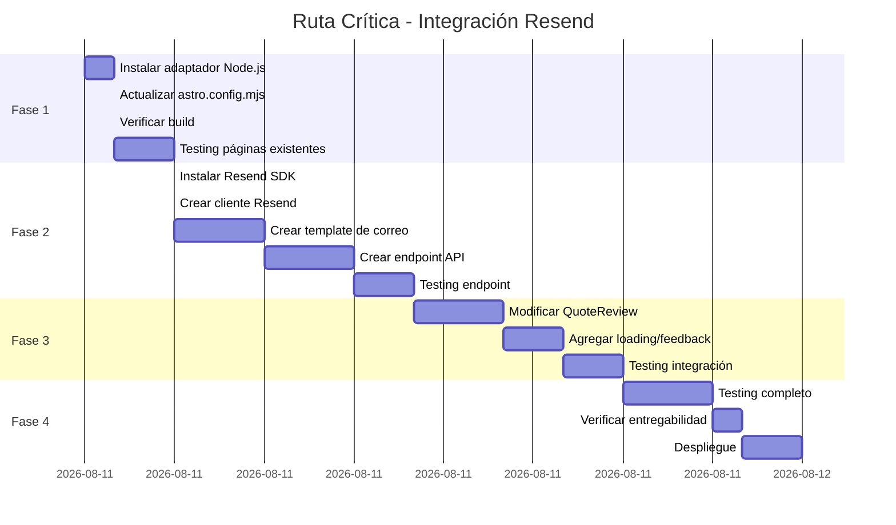

# Effort Analysis: Resend Email Integration

## Resumen Ejecutivo

| Métrica | Valor |
|---------|-------|
| **Esfuerzo Total** | Medio |
| **Duración Estimada** | 2-3 días |
| **Tareas Críticas** | 3 |
| **Dependencias** | 2 (Resend API key, SSR adapter) |

## Desglose de Tareas

### Fase 1: Configuración SSR

| Tarea | Esfuerzo | Duración | Dependencias | Prioridad |
|-------|----------|----------|--------------|-----------|
| Instalar `@astrojs/node` | Bajo | 5 min | Ninguna | Alta |
| Actualizar `astro.config.mjs` | Bajo | 15 min | Adaptador instalado | Alta |
| Verificar build | Bajo | 30 min | Config actualizada | Alta |
| Testing de páginas existentes | Medio | 1-2 hrs | Build exitoso | Alta |

**Subtotal Fase 1**: 2-3 horas

### Fase 2: Backend - Endpoint API

| Tarea | Esfuerzo | Duración | Dependencias | Prioridad |
|-------|----------|----------|--------------|-----------|
| Instalar `resend` SDK | Bajo | 5 min | Ninguna | Alta |
| Crear `src/lib/resend.ts` | Bajo | 15 min | SDK instalado | Alta |
| Crear `src/lib/quoteEmailTemplate.ts` | Medio | 2-3 hrs | Ninguna | Alta |
| Crear `src/pages/api/quote-email.ts` | Medio | 2-3 hrs | Template listo | Alta |
| Testing del endpoint | Medio | 1-2 hrs | Endpoint listo | Alta |

**Subtotal Fase 2**: 5-8 horas

### Fase 3: Frontend - Integración

| Tarea | Esfuerzo | Duración | Dependencias | Prioridad |
|-------|----------|----------|--------------|-----------|
| Modificar `QuoteReview.astro` | Medio | 2-3 hrs | Endpoint listo | Alta |
| Agregar loading state | Bajo | 30 min | Modificación hecha | Media |
| Agregar feedback de éxito/error | Bajo | 1-2 hrs | Loading state | Media |
| Testing de integración | Medio | 1-2 hrs | Todo listo | Alta |

**Subtotal Fase 3**: 4-7 horas

### Fase 4: Testing y Despliegue

| Tarea | Esfuerzo | Duración | Dependencias | Prioridad |
|-------|----------|----------|--------------|-----------|
| Testing en desarrollo | Medio | 2-3 hrs | Todo listo | Alta |
| Verificar entregabilidad | Bajo | 1 hr | Dominio configurado | Media |
| Documentación | Bajo | 1 hr | Testing completo | Baja |
| Despliegue a producción | Medio | 1-2 hrs | Testing exitoso | Alta |

**Subtotal Fase 4**: 5-7 horas

## Total Estimado

| Fase | Horas | Días (8h) |
|------|-------|-----------|
| Fase 1: Configuración SSR | 2-3 | 0.3-0.4 |
| Fase 2: Backend API | 5-8 | 0.6-1.0 |
| Fase 3: Frontend | 4-7 | 0.5-0.9 |
| Fase 4: Testing/Deploy | 5-7 | 0.6-0.9 |
| **TOTAL** | **16-25** | **2-3** |

## Ruta Crítica

## Dependencias

### Dependencias Externas

| Dependencia | Tipo | Estado | Bloqueador |
|-------------|------|--------|------------|
| Resend API Key | Configuración | Pendiente | ✅ Sí |
| Dominio verificado en Resend | Opcional | Pendiente | ❌ No |
| Servidor Node.js en producción | Infraestructura | Verificar | ✅ Sí |

### Dependencias Internas

| Dependencia | Tipo | Estado | Bloqueador |
|-------------|------|--------|------------|
| Cambio a SSR | Arquitectura | Pendiente | ✅ Sí |
| QuoteReview.astro | Componente | Listo | ❌ No |
| quoteMessage.ts | Lib | Listo | ❌ No |
| quoteCart.ts | Lib | Listo | ❌ No |
| quoteCompany.ts | Lib | Listo | ❌ No |

## Riesgos de Esfuerzo

| Riesgo | Probabilidad | Impacto | Mitigación | Effort Adicional |
|--------|--------------|---------|------------|------------------|
| SSR rompe páginas existentes | Media | Alto | Testing exhaustivo | +4-8 hrs |
| Template no compatible con clientes de correo | Media | Bajo | Usar HTML inline simple | +2-4 hrs |
| Problemas con rate limiting | Baja | Bajo | Implementar retry | +1-2 hrs |
| Error en envío a producción | Baja | Medio | Testing previo | +2-4 hrs |

## Recursos Necesarios

### Herramientas

| Herramienta | Propósito | Estado |
|-------------|-----------|--------|
| Node.js >= 22.12.0 | Runtime | ✅ Listo |
| npm | Package manager | ✅ Listo |
| Astro CLI | Build y dev | ✅ Listo |
| Resend Dashboard | Monitoreo | Pendiente |

### Conocimientos

| Área | Nivel Requerido | Notas |
|------|-----------------|-------|
| Astro SSR | Medio | Documentación disponible |
| Resend API | Bajo | API simple y bien documentada |
| TypeScript | Medio | Ya usado en el proyecto |
| HTML Email | Medio | Template inline, responsive |

## Optimizaciones Posibles

### Reducir Esfuerzo

1. **Usar template de ejemplo de Resend** (-2 hrs)
   - Resend provee templates de ejemplo
   - Adaptar en vez de crear desde cero

2. **Implementar solo notificación interna** (-2 hrs)
   - Enviar solo a la empresa, no al cliente
   - Simplifica validación y UX

3. **Usar serverless en vez de SSR** (-4 hrs)
   - No cambiar arquitectura del sitio
   - Usar Vercel/Netlify functions

### Incrementar Calidad

1. **Testing E2E** (+4 hrs)
   - Verificar flujo completo
   - Testing en múltiples clientes de correo

2. **Monitoreo y alertas** (+2 hrs)
   - Tracking de envíos
   - Alertas de fallos

3. **Template responsive** (+3 hrs)
   - Optimizado para móvil
   - Soporte dark mode

## Conclusión

El esfuerzo estimado es **2-3 días** para una implementación completa y robusta. La ruta crítica pasa por:

1. ✅ Cambio a SSR (Fase 1)
2. ✅ Endpoint API (Fase 2)
3. ✅ Integración frontend (Fase 3)

### Recomendación

- **Implementación mínima**: 1.5 días (solo notificación interna)
- **Implementación completa**: 2-3 días (notificación + confirmación)
- **Implementación premium**: 4-5 días (con testing E2E y monitoreo)

### Priorización

Si el tiempo es limitado, priorizar:

1. **Must Have**: Endpoint API + envío a empresa
2. **Should Have**: Feedback visual en UI
3. **Nice Have**: Confirmación al cliente + template responsive
