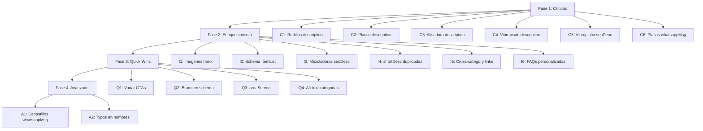

# Catálogo de Mejoras SEO — Rental de Equipos

> **Documento:** Plan de acción paso a paso
> **Fecha:** 11 de agosto de 2026
> **Base:** Auditoría SEO en `plans/seo-audit-rental-equipos.md`
> **Stack:** Astro 7 + TypeScript (SSG) + WordPress headless (planificado)

---

## Índice

1. [Fase 1 — Correcciones Críticas](#fase-1--correcciones-críticas)
   - [C1: Expandir description SEO de Rodillos](#c1-expandir-description-seo-de-rodillos)
   - [C2: Expandir description SEO de Placas Compactadoras](#c2-expandir-description-seo-de-placas-compactadoras)
   - [C3: Expandir description SEO de Alisadora de Pavimento](#c3-expandir-description-seo-de-alisadora-de-pavimento)
   - [C4: Expandir description SEO de Vibropisón](#c4-expandir-description-seo-de-vibropisón)
   - [C5: Corregir error copy-paste en seoDescription de Vibropisón](#c5-corregir-error-copy-paste-en-seodescription-de-vibropisón)
   - [C6: Corregir error copy-paste en whatsappMessage de Placas Compactadoras](#c6-corregir-error-copy-paste-en-whatsappmessage-de-placas-compactadoras)
2. [Fase 2 — Enriquecimiento de Contenido](#fase-2--enriquecimiento-de-contenido)
   - [I1: Asignar imágenes hero específicas a 15 subcategorías](#i1-asignar-imágenes-hero-específicas-a-15-subcategorías)
   - [I2: Agregar schema Product individual por equipo del catálogo](#i2-agregar-schema-product-individual-por-equipo-del-catálogo)
   - [I3: Corregir seoDescription de Mezcladoras (altura incorrecta)](#i3-corregir-seodescription-de-mezcladoras-altura-incorrecta)
   - [I4: Diferenciar shortDesc duplicadas](#i4-diferenciar-shortdesc-duplicadas)
   - [I5: Implementar cross-category internal linking](#i5-implementar-cross-category-internal-linking)
   - [I6: Personalizar FAQs por subcategoría](#i6-personalizar-faqs-por-subcategoría)
3. [Fase 3 — Quick Wins](#fase-3--quick-wins)
   - [Q1: Variar CTAs en meta descriptions](#q1-variar-ctas-en-meta-descriptions)
   - [Q2: Agregar brand en Product schema](#q2-agregar-brand-en-product-schema)
   - [Q3: Agregar areaServed en schemas de subcategoría](#q3-agregar-areaserved-en-schemas-de-subcategoría)
   - [Q4: Mejorar alt text en imágenes de categoría](#q4-mejorar-alt-text-en-imágenes-de-categoría)
4. [Fase 4 — Avanzado](#fase-4--avanzado)
   - [A1: Corregir whatsappMessage duplicado en Canastillos](#a1-corregir-whatsappmessage-duplicado-en-canastillos)
   - [A2: Corregir typos en nombres de subcategorías](#a2-corregir-typos-en-nombres-de-subcategorías)

---

## Fase 1 — Correcciones Críticas

> **Objetivo:** Eliminar thin content y errores de copy-paste que pueden afectar la calidad percibida del dominio.
> **Tiempo estimado:** 1-2 días
> **Esfuerzo total:** Medio

---

### C1: Expandir description SEO de Rodillos

**Problema:** Description de solo 25 palabras, sin keywords geográficas ni diferenciadores.
**Impacto:** Alto — Google puede interpretar como thin content.
**Esfuerzo:** Medio (30 min)

#### Archivo
`src/data/rental.ts` — líneas 1158-1202 (constante `EE_RODILLOS`)

#### Pasos

1. **Abrir** `src/data/rental.ts`
2. **Buscar** la constante `EE_RODILLOS` (línea 1158)
3. **Reemplazar** el campo `description` (líneas 1162-1163):

```typescript
// ❌ ANTES (25 palabras)
description:
  'Arriendo de rodillo vibratorio de doble tambor diseñado para la compactación de asfalto, bases granulares y suelos en obras de construcción, urbanización y mantenimiento vial.',
```

```typescript
// ✅ DESPUÉS (~150 palabras)
description:
  'Arriendo de rodillos compactadores vibratorios de doble tambor en Chile para obras de construcción, pavimentación y mantenimiento vial. Equipos con peso operativo de 830 kg, motor diésel de bajo consumo y arranque eléctrico, ideales para compactación de asfalto, bases granulares, arenas y suelos en obras de urbanización, parques industriales y mantención de caminos. Operador certificado incluido, con experiencia en faenas de pavimentación y control de densidad según normativa MOP. Mantenimiento preventivo, seguros y combustibles incluidos durante todo el período de arriendo. Disponibilidad inmediata en zona norte (Atacama, Coquimbo) y centro de Chile, con respuesta operativa en menos de 24 horas. Excelente maniobrabilidad en espacios reducidos y zanjas. Solución eficiente para proyectos de compactación uniforme en superficies de asfalto, gravilla y suelos cohesivos.',
```

4. **Reemplazar** el campo `seoDescription` (líneas 1179-1180):

```typescript
// ❌ ANTES (52 caracteres)
seoDescription:
  'Arriendo de equipos de Rodillos compactadores. Cotiza online.',
```

```typescript
// ✅ DESPUÉS (~150 caracteres)
seoDescription:
  'Arriendo de rodillos compactadores vibratorios en Chile. Peso 830 kg, motor diésel, doble tambor. Ideal para asfalto y suelos. Operador certificado. Cotiza online.',
```

5. **Guardar** el archivo

---

### C2: Expandir description SEO de Placas Compactadoras

**Problema:** Description de 25 palabras, estructura idéntica a rodillos (copy-paste).
**Impacto:** Alto — Contenido duplicado internamente.
**Esfuerzo:** Medio (30 min)

#### Archivo
`src/data/rental.ts` — líneas 1204-1248 (constante `EE_PLACAS_COMPACTADORAS`)

#### Pasos

1. **Abrir** `src/data/rental.ts`
2. **Buscar** la constante `EE_PLACAS_COMPACTADORAS` (línea 1204)
3. **Reemplazar** el campo `description` (líneas 1208-1209):

```typescript
// ❌ ANTES (25 palabras)
description:
  'Arriendo de placa compactadora diseñado para la compactación de asfalto, bases granulares y suelos en obras de construcción, urbanización y mantenimiento vial.',
```

```typescript
// ✅ DESPUÉS (~140 palabras)
description:
  'Arriendo de placas compactadoras unidireccionales en Chile para proyectos de construcción, obras civiles y paisajismo. Equipos con fuerza de compactación de 15 kN, motor a gasolina de alta confiabilidad y diseño compacto, ideales para veredas, zanjas, pavimentos intertrabados (adoquines), arenas, gravilla y suelos granulares. Base plana de acero con alta eficiencia de compactación en superficies de hasta 30 cm de espesor. Operador certificado incluido, con experiencia en compactación de suelos para fundaciones, estacionamientos, veredas y trabajos de paisajismo. Mantenimiento, seguros y combustibles incluidos durante el arriendo. Disponibilidad inmediata en zona norte (Atacama, Coquimbo) y centro de Chile. Equipos livianos y maniobrables para trabajos en espacios reducidos, zanjas de instalaciones sanitarias y rellenos compactados.',
```

4. **Reemplazar** el campo `seoDescription` (líneas 1225-1226):

```typescript
// ❌ ANTES (52 caracteres)
seoDescription:
  'Arriendo de equipos de Placas compactadoras. Cotiza online.',
```

```typescript
// ✅ DESPUÉS (~150 caracteres)
seoDescription:
  'Arriendo de placas compactadoras 15 kN en Chile. Motor a gasolina, ideal para adoquines, zanjas y suelos granulares. Operador incluido. Cotiza online.',
```

5. **Guardar** el archivo

---

### C3: Expandir description SEO de Alisadora de Pavimento

**Problema:** Description de solo 15 palabras, sin contenido técnico relevante.
**Impacto:** Alto — Thin content severo.
**Esfuerzo:** Medio (30 min)

#### Archivo
`src/data/rental.ts` — líneas 1250-1294 (constante `EE_ALISADORA_PAVIMENTO`)

#### Pasos

1. **Abrir** `src/data/rental.ts`
2. **Buscar** la constante `EE_ALISADORA_PAVIMENTO` (línea 1250)
3. **Reemplazar** el campo `description` (líneas 1254-1255):

```typescript
// ❌ ANTES (15 palabras)
description:
  'Arriendo de alisadora de pavimentos para acabado profesional. Cotiza online.',
```

```typescript
// ✅ DESPUÉS (~140 palabras)
description:
  'Arriendo de alisadoras de pavimento en Chile para acabado profesional de superficies de hormigón. Equipos con diámetro de trabajo de 915 mm (36 pulgadas), motor a gasolina de alto rendimiento y diseño robusto para uso intensivo en faenas de construcción. Ideales para losas industriales, pavimentos, radieres, fundaciones y superficies de hormigón que requieren un terminado uniforme y de alta calidad. Sistema de alisado con paletas metálicas que proporcionan un acabado liso o texturizado según requerimiento del proyecto. Operador certificado incluido, con experiencia en acabados de hormigón para pisos industriales, estacionamientos, bodegas y obras civiles. Mantenimiento, seguros y combustibles incluidos durante el arriendo. Disponibilidad inmediata en zona norte (Atacama, Coquimbo) y centro de Chile con respuesta operativa en menos de 24 horas.',
```

4. **Reemplazar** el campo `seoDescription` (líneas 1271-1272):

```typescript
// ❌ ANTES (45 caracteres)
seoDescription:
  'Arriendo de Alisadora de Pavimentos. Cotiza online.',
```

```typescript
// ✅ DESPUÉS (~150 caracteres)
seoDescription:
  'Arriendo de alisadoras de pavimento 915 mm en Chile. Acabado profesional de hormigón, losas industriales y radieres. Operador certificado. Cotiza online.',
```

5. **Guardar** el archivo

---

### C4: Expandir description SEO de Vibropisón

**Problema:** Description de solo 15 palabras, genérica y sin contenido técnico.
**Impacto:** Alto — Thin content severo.
**Esfuerzo:** Medio (30 min)

#### Archivo
`src/data/rental.ts` — líneas 1296-1340 (constante `EE_VIBROPISON`)

#### Pasos

1. **Abrir** `src/data/rental.ts`
2. **Buscar** la constante `EE_VIBROPISON` (línea 1296)
3. **Reemplazar** el campo `description` (líneas 1300-1301):

```typescript
// ❌ ANTES (15 palabras)
description:
  'Arriendo de equipo compactador de suelos para acabado profesional. Cotiza online.',
```

```typescript
// ✅ DESPUÉS (~140 palabras)
description:
  'Arriendo de vibropisones diésel en Chile para compactación de suelos cohesivos, zanjas, rellenos y áreas de difícil acceso. Equipos con fuerza de impacto de 21 kN, motor diésel Yanmar de bajo consumo y construcción robusta para uso intensivo en faenas de construcción, minería y obras civiles. Altura de salto optimizada para compactación eficiente en suelos arcillosos, mixtos y rellenos de zanjas. Diseño compacto y maniobrable para trabajos en espacios reducidos, canalizaciones, fundaciones puntuales y obras sanitarias. Operador certificado incluido, con experiencia en compactación localizada según normativa MOP y estándares de calidad. Mantenimiento preventivo, seguros y combustibles incluidos durante todo el período de arriendo. Disponibilidad inmediata en zona norte (Atacama, Coquimbo) y centro de Chile con respuesta operativa en menos de 24 horas.',
```

4. **Reemplazar** el campo `seoDescription` (líneas 1317-1318):

```typescript
// ❌ ANTES (45 caracteres, con error de copy-paste)
seoDescription:
  'Arriendo de Alisadora de Vibropisón. Cotiza online.',
```

```typescript
// ✅ DESPUÉS (~150 caracteres, corregido)
seoDescription:
  'Arriendo de vibropisón diésel 21 kN en Chile. Compactación de suelos cohesivos, zanjas y rellenos. Motor Yanmar, operador incluido. Cotiza online.',
```

5. **Guardar** el archivo

---

### C5: Corregir error copy-paste en seoDescription de Vibropisón

**Problema:** El seoDescription dice "Alisadora de Vibropisón" (error de copy-paste desde alisadora).
**Impacto:** Alto — Error visible en resultados de búsqueda de Google.
**Esfuerzo:** Bajo (5 min)

> **Nota:** Este error se corrige automáticamente al aplicar el paso C4 anterior. Si solo quieres corregir el error sin expandir la description, modifica solo la línea 1318.

#### Archivo
`src/data/rental.ts` — línea 1318

#### Paso rápido

```typescript
// ❌ ANTES
'Arriendo de Alisadora de Vibropisón. Cotiza online.',

// ✅ DESPUÉS (mínimo, si no aplicas C4 completo)
'Arriendo de Vibropisón diésel en Chile. Cotiza online.',
```

---

### C6: Corregir error copy-paste en whatsappMessage de Placas Compactadoras

**Problema:** El whatsappMessage dice "rodillo compactador" en lugar de "placa compactadora".
**Impacto:** Medio — Mensaje incorrecto al contactar por WhatsApp.
**Esfuerzo:** Bajo (2 min)

#### Archivo
`src/data/rental.ts` — línea 1247

#### Pasos

1. **Abrir** `src/data/rental.ts`
2. **Buscar** la línea 1247 dentro de `EE_PLACAS_COMPACTADORAS`
3. **Reemplazar**:

```typescript
// ❌ ANTES
whatsappMessage: 'Hola IP, quisiera cotizar arriendo de rodillo compactador.',

// ✅ DESPUÉS
whatsappMessage: 'Hola IP, quisiera cotizar arriendo de placa compactadora.',
```

4. **Guardar** el archivo

---

## Fase 2 — Enriquecimiento de Contenido

> **Objetivo:** Mejorar la calidad SEO con imágenes específicas, schemas enriquecidos y contenido personalizado.
> **Tiempo estimado:** 3-5 días
> **Esfuerzo total:** Alto

---

### I1: Asignar imágenes hero específicas a 15 subcategorías

**Problema:** 15 de las 24 subcategorías usan `hero.jpg` genérico como imagen principal.
**Impacto:** Medio — Pierde oportunidad de ranking en Google Images y señales de relevancia temática.
**Esfuerzo:** Alto (requiere producción fotográfica o selección de imágenes)

#### Archivo
`src/data/rental.ts` — campo `heroImage` de cada subcategoría afectada

#### Subcategorías afectadas y solución

Las imágenes AVIF específicas ya existen en el directorio de assets. Solo necesitas reasignarlas como `heroImage` de cada subcategoría.

| Subcategoría | Imagen AVIF disponible | Línea actual |
|---|---|---|
| camiones-pluma | `camionPluma5t` (primer equipo) | ~L789 |
| alza-hombre | `alzaHombre20m` | ~L847 |
| gruas-horquilla | `gruaHorquilla3t` | ~L905 |
| camiones-tolva | `camionTolva12m3` | ~L963 |
| retroexcavadoras | `retroexcavadoraJohnDeere320d` | ~L1021 |
| minicargadores | `minicargadorVolvoMc90b` | ~L1079 |
| tracto-camiones | `tractoCamionRenaultT460` | ~L581 |
| cama-baja | `camaBajaEagerBeaver70t` | ~L639 |
| semiremolques | `semiremolqueRandon` | ~L697 |
| torres-iluminacion | `torreIluminacion9mWackerNeuson` | ~L755 |
| bombas-hormigon | `bombaDeHormigonTruemaxTm50d` | ~L813 |
| compresores-aire | `compresorAireAirmanPds390s4B1` | ~L871 |
| generadores-electricos | `generadorElectrico6kvaEuropArdHdy` | ~L929 |
| termofusionadoras | `termofusionadoraElectricaRitmo360mm` | ~L987 |
| rodillos | `rodilloCompactador` | L1177 |
| placas-compactadoras | `placaCompactadora15kn` | L1223 |
| alisadora-de-pavimento | `alisadoraPavimento915mm` | L1269 |
| vibropison | `vibropison21kn` | L1315 |
| mezcladoras-electricas | `mezcladoraElectrica400lEmaresaHv400` | L1361 |
| canastillos-alza-hombre | `canastillaAlzaHombreMetalicoOrmet2MF` | L1397 |

#### Pasos (ejemplo para rodillos)

1. **Abrir** `src/data/rental.ts`
2. **Buscar** `EE_RODILLOS` (línea 1158)
3. **Reemplazar** el campo `heroImage`:

```typescript
// ❌ ANTES
heroImage: HERO,

// ✅ DESPUÉS
heroImage: RODILLO_COMPACTADOR,
```

4. **Repetir** para cada subcategoría usando la imagen AVIF de su primer equipo del catálogo
5. **Guardar** el archivo

#### Nota importante
Las variables de importación ya existen al inicio del archivo (líneas 44-50). Verifica que la constante `HERO` (hero.jpg) sea reemplazada por la variable correspondiente del equipo representativo de cada subcategoría.

---

### I2: Agregar schema Product individual por equipo del catálogo

**Problema:** Actualmente solo hay un schema Product por subcategoría, no por equipo individual.
**Impacto:** Alto — Google puede mostrar rich snippets por equipo individual.
**Esfuerzo:** Medio (2-3 horas de desarrollo)

#### Archivos
- `src/pages/arriendo/[categoria]/[subcategoria].astro` — líneas 34-47
- `src/lib/seo.ts` — función `productSchemaExtended` (ya soporta brand, sku)

#### Pasos

1. **Abrir** `src/pages/arriendo/[categoria]/[subcategoria].astro`

2. **Modificar** la generación del JSON-LD para incluir un ItemList con Product schemas por equipo:

```typescript
// ❌ ANTES (líneas 34-47)
const jsonLd = combineSchemas(
  productSchemaExtended({
    name: subcategory.name,
    description: subcategory.seoDescription,
    url: Astro.url.pathname,
    image: subcategory.heroImage,
    offers: {
      availability: 'InStock',
      priceCurrency: 'CLP',
      priceRange: 'Consultar',
    },
  }),
  breadcrumbSchema(breadcrumbs)
);
```

```typescript
// ✅ DESPUÉS
import { itemListSchema } from '@/lib/seo';

// Schema principal de la subcategoría
const mainProductSchema = productSchemaExtended({
  name: subcategory.name,
  description: subcategory.seoDescription,
  url: Astro.url.pathname,
  image: subcategory.heroImage,
  brand: 'IP Proyectos Industriales',
  offers: {
    availability: 'InStock',
    priceCurrency: 'CLP',
    priceRange: 'Consultar',
  },
});

// Schema ItemList con Product individual por equipo del catálogo
const catalogItems = subcategory.catalog.map((equipment, index) => ({
  name: equipment.name,
  url: `${Astro.url.pathname}#${equipment.slug}`,
  image: equipment.image,
  description: equipment.shortDesc,
  position: index + 1,
}));

const catalogListSchema = itemListSchema({
  name: `Catálogo de ${subcategory.name}`,
  items: catalogItems,
  url: Astro.url.pathname,
});

const jsonLd = combineSchemas(
  mainProductSchema,
  catalogListSchema,
  breadcrumbSchema(breadcrumbs)
);
```

3. **Guardar** el archivo

#### Resultado esperado
Cada subcategoría tendrá:
- 1 schema `Product` (la subcategoría completa)
- 1 schema `ItemList` con `ListItem` por equipo individual
- 1 schema `BreadcrumbList`
- 1 schema `FAQPage` (generado por FAQSection)

---

### I3: Corregir seoDescription de Mezcladoras (altura incorrecta)

**Problema:** El seoDescription menciona "altura hasta 18 m" que es un dato incorrecto (no tiene altura, es capacidad de 250-500L).
**Impacto:** Medio — Información engañosa en resultados de búsqueda.
**Esfuerzo:** Bajo (5 min)

#### Archivo
`src/data/rental.ts` — línea 1364

#### Pasos

1. **Abrir** `src/data/rental.ts`
2. **Buscar** la constante `EE_MEZCLADORAS_ELECTRICAS` (línea 1342)
3. **Reemplazar** el campo `seoDescription`:

```typescript
// ❌ ANTES (dato incorrecto: "altura hasta 18 m")
seoDescription:
  'Arriendo de mezcladora eléctrica en Chile. Capacidad 250 a 500 L, altura hasta 18 m. Operador certificado. Cotiza online.',
```

```typescript
// ✅ DESPUÉS (datos correctos)
seoDescription:
  'Arriendo de mezcladora eléctrica en Chile. Capacidad 250 a 500 L, rendimiento 4 m³/h. Motor eléctrico 3 HP. Operador incluido. Cotiza online.',
```

4. **Guardar** el archivo

---

### I4: Diferenciar shortDesc duplicadas

**Problema:** 4 subcategorías comparten la misma shortDesc: "Equipos de compactación y terminación de pavimentos".
**Impacto:** Medio — Contenido duplicado internamente, pobre diferenciación en listados.
**Esfuerzo:** Bajo (15 min)

#### Archivo
`src/data/rental.ts`

#### Pasos

1. **Abrir** `src/data/rental.ts`
2. **Reemplazar** cada `shortDesc` duplicada:

**Rodillos** (línea 1161):
```typescript
// ❌ ANTES
shortDesc: 'Equipos de compactación y terminación de pavimentos',

// ✅ DESPUÉS
shortDesc: 'Rodillo vibratorio de doble tambor para compactación de asfalto, bases granulares y suelos en obras viales y de urbanización.',
```

**Placas Compactadoras** (línea 1207):
```typescript
// ❌ ANTES
shortDesc: 'Equipos de compactación y terminación de pavimentos',

// ✅ DESPUÉS
shortDesc: 'Placa compactadora unidireccional de 15 kN para adoquines, zanjas, veredas y suelos granulares en construcción y obras civiles.',
```

**Alisadora de Pavimento** (línea 1253):
```typescript
// ❌ ANTES
shortDesc: 'Equipos de compactación y terminación de pavimentos',

// ✅ DESPUÉS
shortDesc: 'Alisadora de pavimentos de 915 mm para acabado profesional de losas industriales, radieres, pavimentos y superficies de hormigón.',
```

**Vibropisón** (línea 1299):
```typescript
// ❌ ANTES
shortDesc: 'Equipos de compactación y terminación de pavimentos',

// ✅ DESPUÉS
shortDesc: 'Vibropisón diésel de 21 kN para compactación de suelos cohesivos, zanjas, rellenos y áreas de difícil acceso en obras y minería.',
```

3. **Guardar** el archivo

---

### I5: Implementar cross-category internal linking

**Problema:** No existe cross-category linking entre subcategorías de diferentes categorías.
**Impacto:** Medio — Pierde oportunidad de distribuir link juice y contextualizar equipos complementarios.
**Esfuerzo:** Medio (2-3 horas)

#### Archivos
- `src/components/rental/RelatedEquipment.astro` — componente existente
- `src/pages/arriendo/[categoria]/[subcategoria].astro` — líneas 52-60
- `src/data/rental.ts` — agregar datos de equipos complementarios

#### Pasos

1. **Abrir** `src/data/rental.ts`
2. **Agregar** un campo opcional `relatedCrossCategory` en la interfaz `RentalSubcategory`:

```typescript
// Buscar la interfaz RentalSubcategory (línea 71) y agregar:
export interface RentalSubcategory {
  // ... campos existentes
  relatedCrossCategory?: Array<{
    categorySlug: string;
    subcategorySlug: string;
    label: string;
  }>;
}
```

3. **Agregar** relaciones cross-category a subcategorías clave:

```typescript
// En IZAJE_CAMIONES_PLUMA, agregar:
relatedCrossCategory: [
  { categorySlug: 'transporte', subcategorySlug: 'cama-baja', label: 'Camas baja para transporte de maquinaria' },
],

// En MT_RETROEXCAVADORAS, agregar:
relatedCrossCategory: [
  { categorySlug: 'transporte', subcategorySlug: 'camiones-tolva', label: 'Camiones tolva para retiro de material' },
],

// En EE_GENERADORES_ELECTRICOS, agregar:
relatedCrossCategory: [
  { categorySlug: 'equipos-especiales', subcategorySlug: 'torres-iluminacion', label: 'Torres de iluminación para faenas nocturnas' },
],
```

4. **Modificar** `src/pages/arriendo/[categoria]/[subcategoria].astro` (líneas 52-60):

```typescript
// ❌ ANTES: Solo equipos hermanos
const relatedItems = category.subcategories
  .filter((s) => s.slug !== subcategory.slug)
  .slice(0, 4)
  .map((s) => ({
    name: s.name,
    shortDesc: s.shortDesc,
    href: `/arriendo/${category.slug}/${s.slug}`,
    badge: s.catalog[0]?.capacity,
  }));

// ✅ DESPUÉS: Equipos hermanos + cross-category
const siblingItems = category.subcategories
  .filter((s) => s.slug !== subcategory.slug)
  .slice(0, 3)
  .map((s) => ({
    name: s.name,
    shortDesc: s.shortDesc,
    href: `/arriendo/${category.slug}/${s.slug}`,
    badge: s.catalog[0]?.capacity,
  }));

const crossCategoryItems = (subcategory.relatedCrossCategory ?? []).map((rel) => {
  const relSubcategory = findSubcategory(rel.categorySlug, rel.subcategorySlug);
  return {
    name: relSubcategory?.name ?? rel.label,
    shortDesc: relSubcategory?.shortDesc ?? rel.label,
    href: `/arriendo/${rel.categorySlug}/${rel.subcategorySlug}`,
    badge: relSubcategory?.catalog[0]?.capacity,
  };
});

const relatedItems = [...siblingItems, ...crossCategoryItems];
```

5. **Importar** `findSubcategory` en la página:

```typescript
import { RENTAL_CATEGORIES, findSubcategory } from '@/data/rental';
```

6. **Guardar** los archivos

---

### I6: Personalizar FAQs por subcategoría

**Problema:** Las 5 FAQs genéricas son idénticas en todas las 24 subcategorías.
**Impacto:** Medio — Pierde oportunidad de rich snippets específicos y relevancia temática.
**Esfuerzo:** Alto (4-6 horas de contenido)

#### Archivo
`src/pages/arriendo/[categoria]/[subcategoria].astro` — líneas 63-84

#### Pasos

1. **Abrir** `src/pages/arriendo/[categoria]/[subcategoria].astro`
2. **Crear** un mapa de FAQs personalizadas por slug de subcategoría:

```typescript
// ❌ ANTES: FAQs genéricas para todas las subcategorías (líneas 63-84)
const faqItems = [
  {
    question: `¿Cuánto cuesta arrendar ${subcategory.name.toLowerCase()} en Chile?`,
    answer: `El precio del arriendo de ${subcategory.name.toLowerCase()} depende de la duración, ubicación y modelo específico. Solicita una cotización personalizada y recibirás respuesta en menos de 48 horas.`,
  },
  // ... 4 preguntas genéricas más
];

// ✅ DESPUÉS: FAQs personalizadas por subcategoría
const FAQ_MAP: Record<string, Array<{ question: string; answer: string }>> = {
  'rodillos': [
    {
      question: '¿Qué tipos de suelo se pueden compactar con un rodillo vibratorio?',
      answer: 'Nuestros rodillos compactadores de doble tambor son ideales para compactación de asfalto, bases granulares, arenas, gravilla y suelos cohesivos. Son especialmente efectivos en obras de pavimentación, urbanización y mantenimiento vial.',
    },
    {
      question: '¿Cuál es el peso operativo del rodillo compactador en arriendo?',
      answer: 'El rodillo compactador tiene un peso operativo de 830 kg con motor diésel de bajo consumo y arranque eléctrico. Su diseño compacto permite excelente maniobrabilidad en espacios reducidos y zanjas.',
    },
    {
      question: '¿El operador está incluido en el arriendo del rodillo?',
      answer: 'Sí, todos nuestros rodillos se entregan con operador certificado con experiencia en faenas de pavimentación y control de densidad según normativa MOP. Mantenimiento, seguros y combustibles incluidos.',
    },
    {
      question: '¿Cuál es la disponibilidad de arriendo de rodillos en zona norte?',
      answer: 'Tenemos disponibilidad inmediata en Atacama, Coquimbo y centro de Chile con respuesta operativa en menos de 24 horas. Consulta por otras regiones.',
    },
  ],
  'placas-compactadoras': [
    {
      question: '¿Para qué tipo de trabajos sirve una placa compactadora?',
      answer: 'Las placas compactadoras unidireccionales de 15 kN son ideales para compactación de adoquines (pavimentos intertrabados), veredas, zanjas, rellenos, suelos granulares, arenas y gravilla en proyectos de construcción y obras civiles.',
    },
    {
      question: '¿Cuál es la fuerza de compactación de la placa en arriendo?',
      answer: 'La placa compactadora tiene una fuerza centrífuga de 15 kN con motor a gasolina de alta confiabilidad. Es efectiva para compactación en capas de hasta 30 cm de espesor en suelos granulares.',
    },
    {
      question: '¿La placa compactadora es maniobrable en espacios reducidos?',
      answer: 'Sí, su diseño compacto y peso reducido la hacen ideal para trabajos en zanjas de instalaciones sanitarias, veredas angostas, estacionamientos y paisajismo donde equipos más grandes no pueden acceder.',
    },
    {
      question: '¿Qué incluye el arriendo de la placa compactadora?',
      answer: 'El arriendo incluye operador certificado, mantenimiento preventivo, seguros y combustibles. Disponibilidad en zona norte (Atacama, Coquimbo) y centro de Chile.',
    },
  ],
  'vibropison': [
    {
      question: '¿Qué es un vibropisón y para qué se usa?',
      answer: 'Un vibropisón es un equipo compactador de impacto diseñado para la compactación de suelos cohesivos, arcillosos y mixtos. Se utiliza en zanjas, rellenos, fundaciones, canalizaciones y obras sanitarias donde se requiere compactación localizada de alta eficiencia.',
    },
    {
      question: '¿Cuál es la fuerza de impacto del vibropisón en arriendo?',
      answer: 'El vibropisón tiene una fuerza de impacto de 21 kN con motor diésel Yanmar de bajo consumo. Su altura de salto optimizada permite compactación eficiente en suelos arcillosos y rellenos de zanjas.',
    },
    {
      question: '¿El vibropisón es adecuado para suelos arenosos?',
      answer: 'El vibropisón está diseñado principalmente para suelos cohesivos y mixtos. Para suelos granulares y arenas recomendamos la placa compactadora. Nuestro equipo técnico puede asesorarte en la selección del equipo adecuado según tu tipo de suelo.',
    },
    {
      question: '¿Qué incluye el arriendo del vibropisón?',
      answer: 'Operador certificado con experiencia en compactación según normativa MOP, mantenimiento preventivo, seguros y combustibles incluidos. Disponibilidad inmediata en zona norte y centro de Chile.',
    },
  ],
  // ... agregar FAQs para cada subcategoría
};

// Fallback a FAQs genéricas si no hay personalizadas
const faqItems = FAQ_MAP[subcategory.slug] ?? [
  {
    question: `¿Cuánto cuesta arrendar ${subcategory.name.toLowerCase()} en Chile?`,
    answer: `El precio del arriendo de ${subcategory.name.toLowerCase()} depende de la duración, ubicación y modelo específico. Solicita una cotización personalizada y recibirás respuesta en menos de 48 horas.`,
  },
  {
    question: '¿El operador está incluido en el arriendo?',
    answer: 'Sí, todos nuestros equipos se entregan con operador certificado y planes de trabajo según el requerimiento de la faena.',
  },
  {
    question: '¿Cuál es la disponibilidad geográfica?',
    answer: 'Tenemos cobertura en zona norte (Atacama, Coquimbo) y centro de Chile. Para otras regiones, consultar disponibilidad.',
  },
  {
    question: '¿Qué documentos se requieren para arrendar?',
    answer: 'Orden de compra, contrato de arriendo firmado y, según el caso, permiso de trabajo o plan de izaje aprobado.',
  },
  {
    question: '¿Cuál es el tiempo mínimo de arriendo?',
    answer: 'El arriendo mínimo es de 1 turno (8 horas) para equipos menores y 1 día (24 horas) para grúas de alto tonelaje.',
  },
];
```

3. **Guardar** el archivo
4. **Repetir** el proceso para cada subcategoría (agregar entradas al `FAQ_MAP`)

---

## Fase 3 — Quick Wins

> **Objetivo:** Mejoras de bajo esfuerzo con beneficio inmediato.
> **Tiempo estimado:** 1-2 horas
> **Esfuerzo total:** Bajo

---

### Q1: Variar CTAs en meta descriptions

**Problema:** Patrón repetitivo "Cotiza online." al final de ~10 meta descriptions.
**Impacto:** Bajo — Monotonía en resultados de búsqueda.
**Esfuerzo:** Bajo (30 min)

#### Archivo
`src/data/rental.ts`

#### Pasos

1. **Abrir** `src/data/rental.ts`
2. **Buscar** todas las ocurrencias de `Cotiza online.` en campos `seoDescription`
3. **Alternar** entre estos CTAs para variar:

| CTA | Uso sugerido |
|-----|-------------|
| `Cotiza online.` | Subcategorías de izaje (ya establecido) |
| `Solicita cotización personalizada.` | Equipos especiales |
| `Responde en 24h.` | Subcategorías con alta demanda |
| `Disponibilidad inmediata.` | Subcategorías con stock |
| `Operador certificado incluido.` | Cuando el operador es diferenciador |
| `Consulta disponibilidad por región.` | Para keywords geográficas |

4. **Ejemplo de variación**:

```typescript
// Rodillos
seoDescription: '...Operador certificado incluido. Solicita cotización personalizada.',

// Placas compactadoras
seoDescription: '...Operador incluido. Disponibilidad inmediata en zona norte y centro.',

// Vibropisón
seoDescription: '...Motor Yanmar de bajo consumo. Responde en 24h.',
```

5. **Guardar** el archivo

---

### Q2: Agregar brand en Product schema

**Problema:** Los Product schemas no incluyen la propiedad `brand`.
**Impacto:** Medio — Google puede mostrar marca en rich snippets.
**Esfuerzo:** Bajo (10 min)

#### Archivo
`src/pages/arriendo/[categoria]/[subcategoria].astro` — líneas 35-44

#### Pasos

1. **Abrir** `src/pages/arriendo/[categoria]/[subcategoria].astro`
2. **Modificar** la llamada a `productSchemaExtended`:

```typescript
// ❌ ANTES (líneas 35-44)
productSchemaExtended({
  name: subcategory.name,
  description: subcategory.seoDescription,
  url: Astro.url.pathname,
  image: subcategory.heroImage,
  offers: {
    availability: 'InStock',
    priceCurrency: 'CLP',
    priceRange: 'Consultar',
  },
}),
```

```typescript
// ✅ DESPUÉS
productSchemaExtended({
  name: subcategory.name,
  description: subcategory.seoDescription,
  url: Astro.url.pathname,
  image: subcategory.heroImage,
  brand: 'IP Proyectos Industriales',
  offers: {
    availability: 'InStock',
    priceCurrency: 'CLP',
    priceRange: 'Consultar',
  },
}),
```

3. **Guardar** el archivo

> **Nota:** La función `productSchemaExtended` en `src/lib/seo.ts` ya soporta el campo `brand` (línea 119, 142). Solo necesitas pasarlo.

---

### Q3: Agregar areaServed en schemas de subcategoría

**Problema:** Los schemas Product de subcategorías no incluyen `areaServed`.
**Impacto:** Bajo — Pierde señal geográfica para búsqueda local.
**Esfuerzo:** Bajo (15 min)

#### Archivo
`src/pages/arriendo/[categoria]/[subcategoria].astro`

#### Pasos

1. **Abrir** `src/pages/arriendo/[categoria]/[subcategoria].astro`
2. **Modificar** el Product schema para incluir areaServed manualmente:

```typescript
// Después de llamar a productSchemaExtended, agregar areaServed
const mainProductSchema = productSchemaExtended({
  name: subcategory.name,
  description: subcategory.seoDescription,
  url: Astro.url.pathname,
  image: subcategory.heroImage,
  brand: 'IP Proyectos Industriales',
  offers: {
    availability: 'InStock',
    priceCurrency: 'CLP',
    priceRange: 'Consultar',
  },
});

// Agregar areaServed al schema
mainProductSchema.areaServed = ['CL-II', 'CL-III', 'CL-IV'];
```

3. **Guardar** el archivo

---

### Q4: Mejorar alt text en imágenes de categoría

**Problema:** Alt text genérico en imágenes de categoría ("Arriendo de [categoría]").
**Impacto:** Bajo — Pierde oportunidad de keywords en alt text.
**Esfuerzo:** Bajo (15 min)

#### Archivo
`src/pages/arriendo/[categoria]/index.astro` — línea 48

#### Pasos

1. **Abrir** `src/pages/arriendo/[categoria]/index.astro`
2. **Buscar** el `PageHero` (línea 46-55)
3. **Modificar** el `imageAlt`:

```astro
// ❌ ANTES (línea 48)
imageAlt={`Arriendo de ${category.name}`}

// ✅ DESPUÉS
imageAlt={`Arriendo de equipos de ${category.name.toLowerCase()} para minería, construcción e industria en Chile — IP Proyectos Industriales`}
```

4. **Guardar** el archivo

---

## Fase 4 — Avanzado

> **Objetivo:** Correcciones adicionales y mejoras de mayor complejidad.
> **Tiempo estimado:** 1-2 semanas
> **Esfuerzo total:** Alto

---

### A1: Corregir whatsappMessage duplicado en Canastillos

**Problema:** El segundo equipo del catálogo (Canastillo Fibra Ormet 2VE) tiene el whatsappMessage del primer equipo (Metálico Ormet 2MF).
**Impacto:** Medio — Mensaje incorrecto al contactar por WhatsApp.
**Esfuerzo:** Bajo (2 min)

#### Archivo
`src/data/rental.ts` — línea 1420

#### Pasos

1. **Abrir** `src/data/rental.ts`
2. **Buscar** la línea 1420 dentro del catálogo de `EE_CANASTILLOS_ALZA_HOMBRE`
3. **Reemplazar**:

```typescript
// ❌ ANTES (dice "Metálico" para el equipo de fibra)
whatsappMessage: 'Hola IP, quisiera cotizar arriendo de Canastillo Alza Hombre Metálico Ormet 2MF.',

// ✅ DESPUÉS
whatsappMessage: 'Hola IP, quisiera cotizar arriendo de Canastillo Alza Hombre de Fibra Ormet 2VE.',
```

4. **Guardar** el archivo

---

### A2: Corregir typos en nombres de subcategorías

**Problema:** Algunos nombres tienen errores tipográficos menores.
**Impacto:** Bajo — Se muestran en titles, breadcrumbs y schemas.
**Esfuerzo:** Bajo (10 min)

#### Archivo
`src/data/rental.ts`

#### Correcciones

| Línea | Campo | ❌ Antes | ✅ Después |
|-------|-------|----------|-----------|
| 1206 | `name` | `'Placas Compactadores'` | `'Placas Compactadoras'` |
| 1382 | `name` | `'Canastilos Alza Hombre'` | `'Canastillos Alza Hombre'` |
| 1345 | `shortDesc` | `'Mezcladora eléctrica.'` | `'Mezcladora eléctrica de hormigón para preparación de concreto en construcción y minería.'` |
| 1383 | `shortDesc` | `'Canastilos Alza Hombre.'` | `'Canastillos certificados para trabajos en altura con camión pluma o grúa articulada.'` |

#### Pasos

1. **Abrir** `src/data/rental.ts`
2. **Buscar y reemplazar** cada error según la tabla
3. **Guardar** el archivo

---

## Resumen de Archivos Afectados

| Archivo | Mejoras | Fase |
|---------|---------|------|
| `src/data/rental.ts` | C1, C2, C3, C4, C5, C6, I1, I3, I4, I5, Q1, A1, A2 | 1, 2, 3, 4 |
| `src/pages/arriendo/[categoria]/[subcategoria].astro` | I2, I5, I6, Q2, Q3 | 2, 3 |
| `src/pages/arriendo/[categoria]/index.astro` | Q4 | 3 |
| `src/components/rental/RelatedEquipment.astro` | I5 (si se modifica el componente) | 2 |
| `src/lib/seo.ts` | Ninguno (ya soporta brand, sku, itemList) | — |

---

## Checklist de Verificación Post-Implementación

Después de aplicar cada mejora, verificar:

- [ ] `npm run build` ejecuta sin errores
- [ ] Todas las 29 páginas de rental se generan correctamente
- [ ] Validar JSON-LD con [Google Rich Results Test](https://search.google.com/test/rich-results)
- [ ] Verificar meta descriptions en el código fuente de cada página
- [ ] Comprobar que las imágenes hero se cargan correctamente
- [ ] Validar que los mensajes de WhatsApp son correctos
- [ ] Verificar que el sitemap incluye todas las páginas
- [ ] Comprobar internal links cross-category en páginas afectadas
- [ ] Validar FAQs personalizadas con schema FAQPage

---

## Métricas de Éxito

| Métrica | Antes | Después (objetivo) |
|---------|-------|-------------------|
| Páginas con description > 120 palabras | 18/29 (62%) | 29/29 (100%) |
| Subcategorías con imagen hero específica | 9/24 (37%) | 24/24 (100%) |
| Schemas JSON-LD por página (promedio) | 4 | 5+ |
| Internal links cross-category | 0 | 2+ por subcategoría |
| FAQs personalizadas por equipo | 0/24 | 24/24 |
| Errores de copy-paste | 4 | 0 |
| Meta descriptions únicas (> 120 chars) | ~15/29 | 29/29 |

---

## Orden de Ejecución Recomendado



---

## Notas Finales

- **Prioridad máxima:** Fase 1 (correcciones críticas) debe completarse en 1-2 días
- **Testing:** Ejecutar `npm run build` después de cada cambio para verificar que no hay errores
- **SEO validation:** Usar Google Rich Results Test y Lighthouse para validar mejoras
- **WordPress headless:** Cuando se integre WordPress, las descriptions y FAQs podrían gestionarse desde el CMS
- **Imágenes:** Para I1, las imágenes AVIF ya existen en el proyecto; solo necesitan ser reasignadas como heroImage
