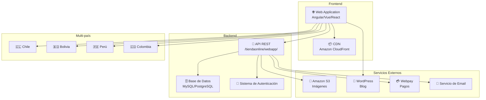
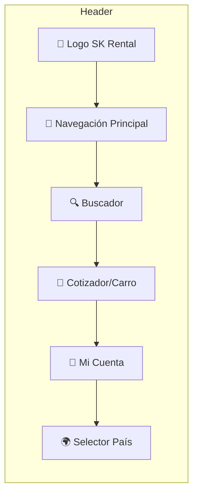
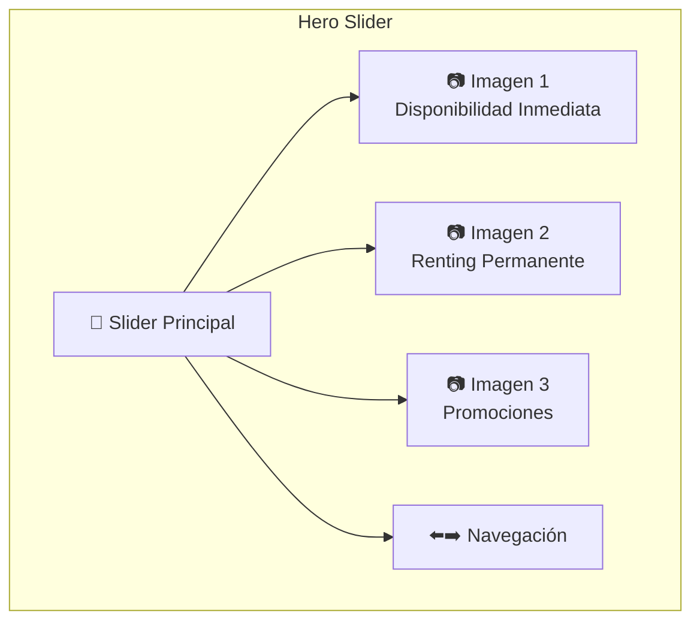
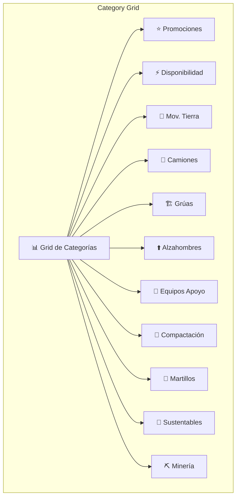
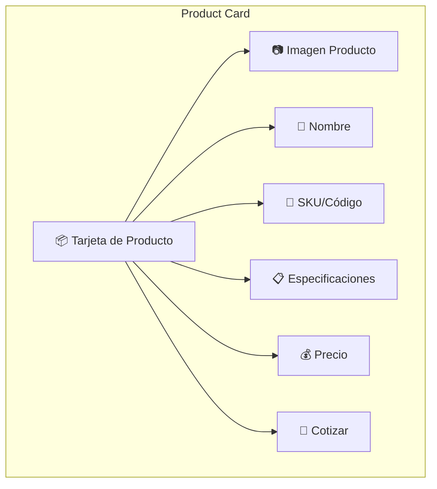
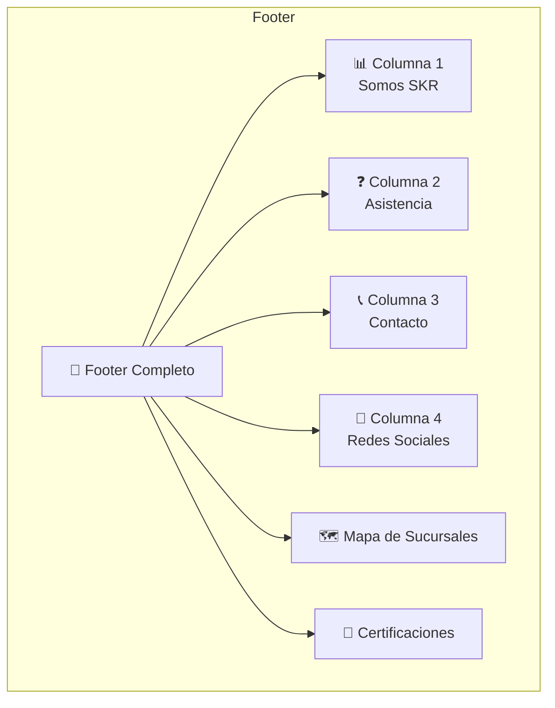
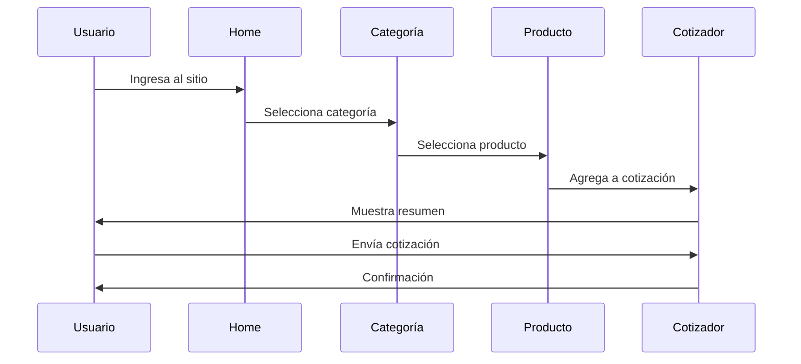
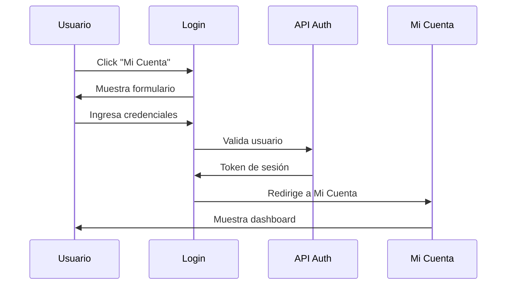

# Análisis de Componentes y Arquitectura - SK Rental Chile

## 🏗️ Arquitectura General del Sistema



---

## 🧩 Componentes Principales de la UI

### 1. **Header Component**



**Funcionalidades:**
- Logo clickeable (vuelve al home)
- Menú mega dropdown con categorías
- Buscador de productos en tiempo real
- Contador de productos en cotización
- Login rápido
- Selector de país (CL, BO, PE, CO)

### 2. **Hero Slider Component**



**Características:**
- Imágenes responsivas (WebP)
- Navegación automática y manual
- Enlaces a categorías relevantes
- Adaptado a móvil

### 3. **Category Grid Component**



**Estructura de cada tarjeta:**
- Imagen representativa (350x350 WebP)
- Título de categoría
- Lista de subcategorías
- Enlace a listado completo

### 4. **Product Card Component**



**Información mostrada:**
- Imagen del producto
- Nombre y modelo
- Código de arriendo (SKU)
- Especificaciones principales
- Disponibilidad
- Botón de cotización

### 5. **Footer Component**



**Contenido:**
- Enlaces a información corporativa
- Preguntas frecuentes
- Términos y condiciones
- Datos de contacto (teléfono, email)
- Redes sociales (Facebook, YouTube, LinkedIn, Instagram)
- Mapa de sucursales
- Certificaciones (ISO 9001, UKAS)

---

## 🔄 Flujo de Usuario

### Flujo de Cotización



### Flujo de Login



---

## 📱 Componentes Responsivos

### Breakpoints Detectados

| Dispositivo | Ancho | Comportamiento |
|-------------|-------|----------------|
| **Desktop** | >1200px | Layout completo, mega menu |
| **Tablet** | 768-1200px | Menú汉堡, grid adaptado |
| **Móvil** | <768px | Menú hamburguesa, stack vertical |

### Adaptaciones Móvil
- Header simplificado con汉堡 menu
- Slider a pantalla completa
- Grid de categorías en 2 columnas
- Productos en lista vertical
- Footer en acordeón

---

## 🔌 Integraciones Detectadas

### 1. **Amazon S3**
- **Uso**: Almacenamiento de imágenes
- **Bucket**: `bbrskrental.s3-sa-east-1.amazonaws.com`
- **Formato**: WebP optimizado
- **Ejemplo**: `https://bbrskrental.s3-sa-east-1.amazonaws.com/images/slider/mobile-_4_-_1__11zon_2026-07-09-082818.webp`

### 2. **WordPress (Blog)**
- **Dominio**: blog.skrental.com
- **Integración**: Enlaces desde home
- **Contenido**: Artículos sobre maquinaria y tendencias

### 3. **Webpay (Pagos)**
- **Integración**: Pasarela de pagos
- **URL**: `/tiendaonline/webapp/estaticos/webpaysk`
- **Uso**: Pagos de arriendos

### 4. **API REST**
- **Estructura**: `/tiendaonline/webapp/`
- **Métodos**: GET, POST, PUT, DELETE
- **Autenticación**: JWT/Session
- **Formato**: JSON

---

## 🗄️ Modelo de Datos Sugerido

### Productos

```typescript
interface Producto {
  id: number;
  sku: string;
  nombre: string;
  descripcion: string;
  categoria: Categoria;
  subcategoria: Subcategoria;
  especificaciones: Especificacion[];
  imagen: string;
  imagenes: string[];
  precio: number;
  disponibilidad: 'disponible' | 'no_disponible' | 'en_mantenimiento';
  pais: string[];
}
```

### Categorías

```typescript
interface Categoria {
  id: number;
  nombre: string;
  slug: string;
  imagen: string;
  subcategorias: Subcategoria[];
}
```

### Cotización

```typescript
interface Cotizacion {
  id: number;
  usuario: Usuario;
  productos: ProductoCotizado[];
  fecha: Date;
  estado: 'pendiente' | 'enviada' | 'respondida';
  total: number;
}
```

### Usuarios

```typescript
interface Usuario {
  id: number;
  rut: string;
  nombre: string;
  email: string;
  empresa: string;
  telefono: string;
}
```

---

## 🛠️ Stack Tecnológico Recomendado

### Frontend
- **Framework**: Angular/Vue/React (detectado: probablemente Angular)
- **UI Library**: Material UI / Bootstrap / Custom
- **State Management**: NgRx / Vuex / Redux
- **HTTP Client**: Axios / Fetch API

### Backend
- **Runtime**: Node.js / PHP / Java
- **Framework**: Express / Laravel / Spring
- **Database**: MySQL / PostgreSQL
- **Cache**: Redis

### Infraestructura
- **Hosting**: AWS / Azure
- **CDN**: CloudFront / Cloudflare
- **Storage**: S3
- **CI/CD**: GitHub Actions / Jenkins

---

## 📊 Métricas de Rendimiento

### Core Web Vitals (Estimados)

| Métrica | Objetivo | Estado Actual |
|---------|----------|---------------|
| **LCP** | <2.5s | ⚠️ Requiere medición |
| **INP** | <200ms | ⚠️ Requiere medición |
| **CLS** | <0.1 | ⚠️ Requiere medición |

### Optimizaciones Detectadas
- ✅ Imágenes en formato WebP
- ✅ URLs amigables
- ✅ Estructura jerárquica
- ⚠️ Posible lazy loading en imágenes
- ⚠️ Minificación de CSS/JS no verificada

---

## 🔒 Seguridad

### Características Detectadas
- ✅ HTTPS habilitado
- ✅ Login de usuarios
- ⚠️ Rate limiting no verificado
- ⚠️ CSRF protection no verificada
- ⚠️ SQL injection protection no verificada

### Recomendaciones
1. Implementar Content Security Policy (CSP)
2. Agregar rate limiting en API
3. Validar inputs en todos los endpoints
4. Usar tokens CSRF en formularios
5. Implementar CORS properly

---

## 📈 SEO Técnico

### Estructura de URLs
```
https://www.skrental.com/tiendaonline/webapp/[tipo]/[categoría]/[subcategoría]/[id]
```

### Ejemplos:
- Home: `/tiendaonline/webapp/home`
- Categoría: `/tiendaonline/webapp/arriendo/movimiento-de-tierra/107/107`
- Producto: `/tiendaonline/webapp/detalles/excavadora-ec220dl-m/858`

### Recomendaciones SEO
1. Implementar schema markup para productos
2. Agregar hreflang para multi-país
3. Optimizar meta titles y descriptions
4. Implementar breadcrumbs
5. Agregar sitemap dinámico

---

## 🎨 Sistema de Diseño

### Paleta de Colores (Detectada)
- **Primario**: Naranja (#FF6B00 approx)
- **Secundario**: Azul oscuro (#1A1A2E approx)
- **Acento**: Verde (#4CAF50 approx)
- **Neutros**: Grises

### Tipografía
- **Headers**: Bold, sans-serif
- **Body**: Regular, sans-serif
- **Tamaño base**: 16px

### Espaciado
- **Grid**: 12 columnas
- **Margin base**: 16px
- **Padding base**: 24px

---

*Documento generado el 14 de julio de 2026*
*Análisis basado en inspección visual y estructura de código*