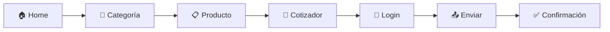

# Resumen Ejecutivo - Análisis SK Rental Chile

## 📊 Visión General

**SK Rental** es una plataforma líder de alquiler de maquinaria pesada en Chile, con operaciones en 4 países de Sudamérica. El sitio opera como un e-commerce B2B especializado en el sector de construcción y minería.

---

## 🎯 Hallazgos Principales

### ✅ Fortalezas Identificadas

| Área | Fortaleza | Impacto |
|------|-----------|---------|
| **SEO** | URLs amigables y estructura jerárquica | Alto |
| **Contenido** | 130+ páginas indexadas | Alto |
| **Multi-mercado** | Presencia en 4 países | Alto |
| **UX** | Cotización online intuitiva | Medio |
| **Imágenes** | Formato WebP optimizado | Medio |

### ⚠️ Áreas de Mejora

| Área | Problema | Prioridad |
|------|----------|-----------|
| **Blog** | Separado en subdominio | Alta |
| **Schema** | No detectado markup estructurado | Alta |
| **Hreflang** | Implementación no verificada | Alta |
| **Velocidad** | Requiere auditoría CWV | Media |
| **Seguridad** | CSP y rate limiting no verificados | Media |

---

## 📈 Métricas Clave

### Contenido del Sitio

| Métrica | Cantidad |
|---------|----------|
| **Páginas totales** | 130+ |
| **Categorías principales** | 11 |
| **Subcategorías** | 35+ |
| **Productos** | 80+ |
| **Países** | 4 |
| **Sucursales Chile** | 11 |

### Estructura de URLs

```
Total URLs indexadas: 130+
- Home: 1
- Páginas estáticas: 8
- Categorías: 11
- Subcategorías: 35+
- Productos: 80+
```

---

## 🏗️ Arquitectura Técnica

### Stack Detectado

| Capa | Tecnología |
|------|------------|
| **Frontend** | Framework JavaScript (Angular/Vue/React) |
| **Backend** | API REST |
| **Base Datos** | MySQL/PostgreSQL |
| **Almacenamiento** | Amazon S3 |
| **CDN** | Amazon CloudFront |
| **Blog** | WordPress |
| **Pagos** | Webpay |

### Multi-País

| País | Dominio | Estado |
|------|---------|--------|
| 🇨🇱 Chile | skrental.com/tiendaonline/ | Principal |
| 🇧🇴 Bolivia | skrental.com/Bolivia/ | Activo |
| 🇵🇪 Perú | skrental.com/Peru/ | Activo |
| 🇨🇴 Colombia | skrental.com/Colombia/ | Activo |

---

## 🔄 Flujo de Usuario

### Proceso de Cotización



### Tiempo Estimado por Flujo

| Flujo | Pasos | Tiempo |
|-------|-------|--------|
| **Exploración** | 3-5 | 2-3 min |
| **Búsqueda** | 2-3 | 1-2 min |
| **Cotización** | 4-6 | 3-5 min |
| **Login** | 2-3 | 1 min |
| **Recuperación** | 4-5 | 2-3 min |

---

## 📊 Análisis Competitivo

### Competidores en Chile

| Competidor | Tipo | Fortaleza |
|------------|------|-----------|
| **Maquinarias y Camiones** | Alquiler | Presencia nacional |
| **BASF Chile** | Construcción | Marca global |
| **Caterpillar Chile** | Equipos | Distribuidor oficial |
| **Komatsu Chile** | Equipos | Tecnología avanzada |

### Diferenciadores SK Rental

1. **Cotización online** - Proceso digital completo
2. **Multi-paño** - Presencia en 4 países
3. **Disponibilidad inmediata** - Stock destacado
4. **Equipos sustentables** - Línea verde
5. **Blog especializado** - Contenido técnico

---

## 🎯 Recomendaciones Prioritarias

### Alta Prioridad

| # | Recomendación | Impacto | Esfuerzo |
|---|---------------|---------|----------|
| 1 | Implementar schema markup | Alto | Medio |
| 2 | Integrar blog en dominio principal | Alto | Alto |
| 3 | Implementar hreflang | Alto | Medio |
| 4 | Auditar Core Web Vitals | Alto | Bajo |

### Media Prioridad

| # | Recomendación | Impacto | Esfuerzo |
|---|---------------|---------|----------|
| 5 | Optimizar imágenes S3 | Medio | Bajo |
| 6 | Implementar breadcrumbs | Medio | Bajo |
| 7 | Agregar Content Security Policy | Medio | Medio |
| 8 | Implementar rate limiting | Medio | Medio |

### Baja Prioridad

| # | Recomendación | Impacto | Esfuerzo |
|---|---------------|---------|----------|
| 9 | Agregar PWA features | Bajo | Alto |
| 10 | Implementar chat en vivo | Bajo | Medio |

---

## 📋 Documentos Generados

| Documento | Descripción |
|-----------|-------------|
| `project-overview.md` | Resumen completo del proyecto |
| `indexed-pages-structure.md` | Todas las páginas indexadas |
| `components-architecture.md` | Análisis de componentes |
| `architecture-diagram.mmd` | Diagrama de arquitectura |
| `user-flow-diagram.mmd` | Flujos de usuario |
| `navigation-structure.mmd` | Estructura de navegación |
| `executive-summary.md` | Este documento |

---

## 🚀 Próximos Pasos

1. **Auditoría técnica completa** con herramientas especializadas
2. **Análisis de competidores** más profundo
3. **Pruebas de rendimiento** (PageSpeed, GTmetrix)
4. **Revisión de código** para oportunidades de mejora
5. **Plan de implementación** priorizado

---

## 📞 Contacto del Analista

**Fecha de análisis**: 14 de julio de 2026
**Herramientas utilizadas**: webfetch, websearch, sitemap analysis
**Alcance**: Análisis estructural y de contenido

---

*Documento generado automáticamente como parte del análisis web de SK Rental Chile*